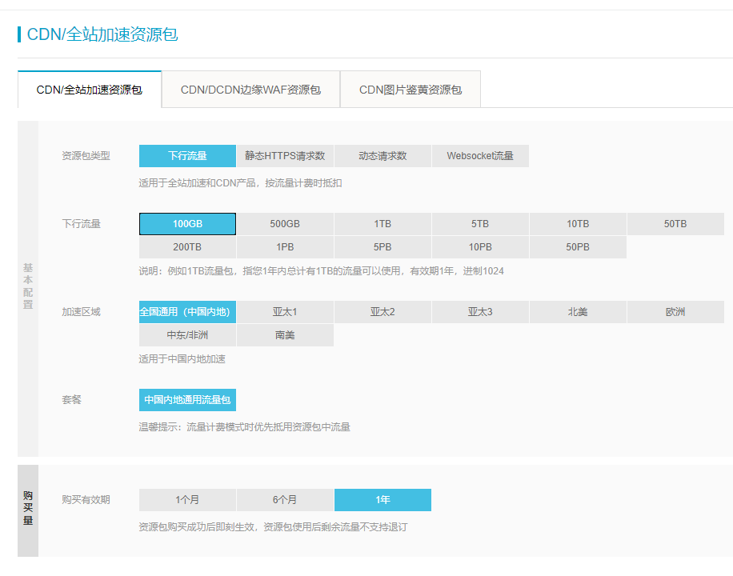
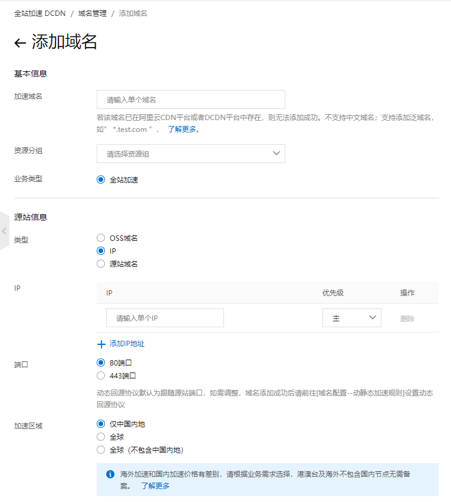

# CDN 是什么可以吃吗

许多人的个人主页可能会部署在 GitHub Pages 上，不过由于众所周知的原因，GitHub Pages 的加载速度实在是堪忧，所以为了更好地面向国内的用户，我们可以考虑使用 CDN 进行加速。

## 什么事 CDN 呀

就像我们访问一些“不存在”的奇怪网站的时候，直接连接是不通的，需要一个代理来进行转发来科学上网一样，CDN 是用来解决资源加载太慢的问题。与科学上网不同，CDN 会在不同国家的节点上缓存自己网站的内容，对于已有的静态资源直接命中，未缓存的资源才会转发回源。而如今我们使用的，大多是全站加速 DCDN，它可以使得动态资源也可以成功加速，这部分资源的加速类似于代理的请求模式。

## CDN 的资源包们

CDN 常用的计费方式一般是按量计费（~~因为按带宽计费太贵了 23333~~），对于最基本的用户来说，买个 100GB/年的下行流量包就足够了，毕竟我们也不用于分发大型文件嘛。

我们在购买资源包的时候，发现还有其他几种资源包，比如静态 HTTPS 请求数和动态请求数资源包。

HTTPS 请求数是云服务中比较恶心的东西（我感觉在请求过程中，对比不开 HTTPS，就多了证书验证的部分啊，为啥还需要额外收费）。如果我们 cdn 不使用 HTTPS 的话，我们加载出来的网页就会告诉我们部分不安全（部分浏览器会有个黄色的锁），而网页所有资源全都是 HTTPS 协议请求的话，一般是绿色的锁。动态请求常见于链接里那些带着问号，后面跟着参数的 URL，这个在 DCDN 里如果不设置忽略的话，这个就需要 CDN 去访问源网站求请求相关资源，消耗动态请求数。

不过好消息是，由于阿里的按量计费是每个小时进行结算的，他们规定“计费明细存在多小数位；汇总进位为 2 位小数时，产生的 3 位及以上小数的金额抹除”，这样其实就告诉我们，只要每个小时自己的消耗不超过 1 分钱，这个小时的请求费用就是免费的。本文编辑时（2021 年 2 月 16 日），静态 HTTPS 请求数的按量计费是 0.05 元/10000 次，也就是说只要每小时 HTTPS 使用不超过 2000 次就是免费的；动态请求数的按量计费是 0.15 元/10000 次，也就是大约每小时 666 次以内是免费的。

**值得注意的是，云服务商的 CDN 通常会要求在国内加速的域名要进行 ICP 备案。**

## 配置一个全站加速

配置全站加速 DCDN 第一步，确保自己的加速域名已经通过了 ICP 备案，否则申请加速是通过不了的。

### 添加域名

我们在阿里云控制台的全站加速模块中，添加域名，我们需要配置源站的相关信息，源站就是 cdn 没有命中回源（即去哪里找）的网站，**不应与加速域名相同（如果源站域名与加速域名相同，则 cdn 在找不到内容后会请求自己资源，而显然 cdn 自己没有这个资源，就会继续请求自己……这样 cdn 一直找不到源资源文件）**。

假设我们的加速域名为`example.com`，想加速`example.github.io`的 GitHub Pages，而且想即便访问`example.github.io`也可以重定向到`example.com`，我们应在 GitHub Pages 中配置 CNAME 为`example.com`，然后源站类型选择源站域名，填写`example.github.io`，端口 443（HTTPS）。

在提交之后，我们需要设置回源 HOST、静态文件（目录）、HTTPS 等。

### 设置回源 HOST

**这一步是非常关键的一步，我就栽在这里一次。**

> 回源 HOST 指全站加速节点在回源过程中，在源站访问的站点域名。

还是上面 GitHub Pages 的例子，我们需要设置 HOST 为加速域名，**而不是`example.github.io`**。如果选择`example.github.io`，GitHub 会由于我们配置了 CNAME，不给予资源文件，而是让 cdn 跳转到加速域名，导致无限循环。（参考[blog](HTTPS://blog.csdn.net/jcq521045349/article/details/103736623)）

### 配置静态文件类型/文件路径

这一步决定哪些文件会让 cdn 进行缓存（没缓存的会回源嘛）。一般我们会配置常见资源类型为图片文档等，我们也可以设置 html,css 等文件的缓存，而文件路径如果为`/`则表示网站的全部资源文件均需要进行缓存。

文件过期时间有几个默认的时间，我们可以按照自己实际情况酌情修改缓存时长。为了避免反复刷新缓存，变化可能比较快的资源建议缓存时长不要太大。

### 设置 HTTPS

HTTPS 如果开启必然会造成一笔不小的 HTTPS 请求资源消耗费用，这部分费用甚至会比流量费还要贵一些，但是开启后会比较安全，建议购买资源包后开启。

#### 获取 SSL 证书

对于 HTTPS，我们首先需要有一个加速域名的 SSL 证书。证书获取方式可以通过云服务商（推荐域名管理商或者 CDN 提供商，可以方便添加 TXT 解析或者方便证书的部署）获得的证书（通常为一年），或者 Let’s encrypt 的三个月证书。

可能有人问，为什么 Let’s encrypt 给的证书只有三个月有效期，根据[官方](HTTPS://letsencrypt.org/2015/11/09/why-90-days.html)的解释，90 天可以减少证书错误分发及密钥泄漏导致的损失，也可以鼓励大家进行自动部署。

获取证书的步骤~~我应该还会再写一篇博客的吧~~见[“聊聊证书”](./3116496963.html)。

#### HTTP2、TLS、强制跳转与 HSTS

HTTP2 和新的 TLS 握手协议可以使得用户访问网站更加安全，比较建议打开。

强制跳转可以让以 http 协议访问的用户被自动跳转到 HTTPS 协议上，以防被中间人攻击。

而 HSTS 是告诉用户，未来 x 天内我这个域名只支持 HTTPS 协议。浏览器得知后，再以后的访问中无需跳转，浏览器会自动修改协议为 HTTPS 协议，减少被中间人攻击的可能。此外开启 HSTS 后，浏览器则不允许忽略证书错误，如果证书过期或者被攻击后，用户无法选择“忽略安全问题（不推荐）”来跳过这个错误，以免造成不必要的风险。

当然后两个开启会让 HTTPS 请求数进一步增加（原本是 http 的也 HTTPS 了），但是还是建议大家开启。

### 其他

- 在缓存配置-HTTP 头中，我们可以自定义 HTTP 头。这个的使用就比如自定义`Access-Control-Allow-Origin`。（这是一个跨域允许的 HTTP 头，我们在网站中通过引用或者 ajax 请求资源的时候，如果资源与访问域名不同，则属于跨域行为。如果请求的资源没有这个请求头则默认不允许跨域请求，强行请求会被浏览器拒绝；这个 HTTP 头的值为允许请求的域名，如为`*`则表示允许任意域名请求。）对于原网站不允许跨域的文件，我们可以自定义允许跨域的 HTTP 头，使得自己的域名允许被跨域访问。
- 访问控制中有一个 URL 鉴权和 Referer 防盗链，前者是需要适当的密钥进行请求资源，才能被 cdn 响应；后者是请求来源必须符合一定规则，但是 referer 只对浏览器请求有效，python 访问甚至可以自定义 referer。这两个综合起来的用途一般是只想在线播放，不希望用户下载的知识产权资源，可以通过后端返回合适的 URL（**写在前端就没用了**），然后供在线浏览使用。