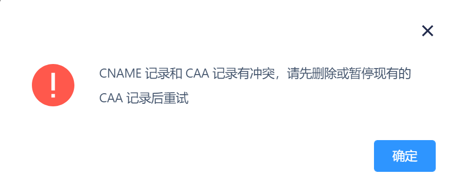
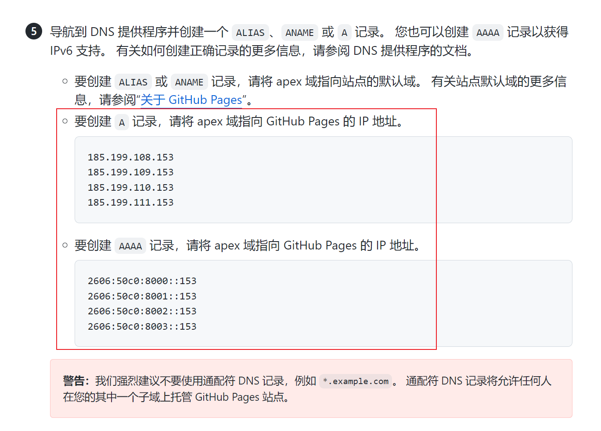
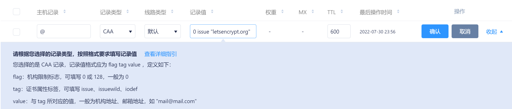

## 引入

之前在[聊聊证书](聊聊证书.md)中提到，在申请时遇到了`Type: caa Detail: CAA record for domain.cn prevents issuance`问题。到底CAA是什么，为什么当时不能申请证书？真的是挖了好久的一个坑，发现最近一直都在填坑诶，这次我们来解释一下这个问题。

> CAA(Certification Authority Authorization，即证书颁发机构授权)是一项防止HTTPS证书错误签发的安全措施，于2013年1月通过互联网工程任务组(IETF)的批准列为[RFC6844](https://datatracker.ietf.org/doc/rfc6844/)，2017年3月，CA浏览器论坛投票通过[187号提案](https://cabforum.org/2017/03/08/ballot-187-make-caa-checking-mandatory/)，要求CA机构从2017年9月8日起执行CAA强制性检查。
>
> CAA标准是指域名所有者在其域名DNS记录的CAA字段中，授权指定CA机构为其域名签发证书，CA机构签发证书时强制性检查CAA记录，如果检查发现未获得授权，将拒绝为该域名签发证书，从而防止未授权HTTPS证书错误签发。如果域名所有者没有为其域名设置CAA记录，那么任何CA都可以为其域名颁发证书。
>
> 要顺利执行CAA标准，需要三方共同完成：
>
> - DNS服务商：升级DNS系统使其支持CAA记录设置;
> - 域名所有者：在DNS记录的CAA字段中，授权指定的几家CA机构为域名签发证书;
> - CA机构： CA机构签发证书之前，强制性检查DNS CAA记录。

这是沃通在2017年的[一篇资讯](https://www.wosign.com/News/dns-caa.htm)，介绍了CAA的作用，简单来讲就是域名证书的申请，要进一步的进行约束。证书的发放，会使得获得私钥的人有代表证书持有人的身份，如果让第三方在持有人不知道的情况下申请，则会带来不必要的麻烦。因此IETF组织认为有必要让域名持有者认定，自己的域名到底可以让哪些证书颁发机构CA（Certification Authority）签发，则白名单之外的CA则不能签发，以起到对域名持有者的保护作用。

## CAA记录的构成

先简单介绍一下CAA记录长什么样子。根据规范，一条CAA记录可以用`CAA <flag> <tag> <value>`表示，是由一个标志字节的`<flag>`和一个被称为属性的 `<tag>`-`<value>`（标签-值）对组成。每个标签的意义和范围如下：

| 标签  | 描述                                                         |
| ----- | ------------------------------------------------------------ |
| flag  | 可填写0或128，用于标志认证机构。<br />默认情况下填写0，表示如果颁发证书机构无法识别本条信息，进行忽略。 |
| tag   | 支持 issue、issuewild 和 iodef。                             |
| value | CA 的域名或用于违规通知的电子邮箱。                          |

而定义的`tag`标签的意义如下：

| 字段      | 说明                                                |
| --------- | --------------------------------------------------- |
| issue     | CA 授权单个证书颁发机构发布的**任何类型域名证书**。 |
| issuewild | CA 授权单个证书颁发机构发布**主机名的通配符证书**。 |
| iodef     | CA 可以将违规的颁发记录 URL 发送给某个电子邮箱。    |

## CAA记录的检索规则

根据[cab论坛的文章](https://cabforum.org/2017/09/27/ballot-214-caa-discovery-cname-errata/)，设被查询的域名为X，X域名**直接**关联CAA记录为CAA(X)，X域名CNAME指向的域名为A(X)，X域名父级域名（如`a.b.com`的父级域名为`b.com`，而`b.com`没有父级域名）为P(X)，则检索规则如下：

1. 如CAA(X)直接存在，则返回CAA(X)
2. 若A(X)存在，在规定的步数（最少8步）内**不能**找到X在CNAME链条的最终域名A^n^(X)，则返回报错` CNAME reaches the maximum number of 8`
3. 若A(X)存在，在规定的步数（最少8步）内能找到X在CNAME链条的最终域名A^n^(X)，而且CAA(A^n^(X))存在，则返回CAA(A^n^(X))
4. 若X不为主域名`xxx.com`，且CAA(P(X))存在，则返回CAA(P(X))，否则依次找CAA(P(P(X)))等，直到检索主域名的CAA记录
5. 如第四步找不到CAA记录，返回空

用Python代码写起来就是

```python3
# step 1 & 3
step = 8
target = X
while step >= 0:
    if A(target) is null:
        break
    target = A(target)
    step -= 1
# step 2
if step < 0:
    return error("CNAME reaches the maximum number of 8.")
if CAA(target) is not null:
    return CAA(target)
# step 4
while P(X) is not null:
    if CAA(P(X)) is not null:
        return CAA(P(X))
    X = P(X)
# step 5
return null
```

可能有的人想问了，如果在第3步中，CNAME链条的某个域名配置了CAA记录呢？根据测试，CNAME和CAA记录不共存，在DNSPods添加记录时会报错。



## 失误的复现

当时申请的是`*.oops-sdu.cn`及`oops-sdu.cn`域名的SSL证书，而`oops-sdu.cn`设置的是`oops-sdu.github.io`的CNAME解析。根据上面的规则，CA会查询`oops-sdu.github.io`的CAA记录，查询结果如下：

```text
;; ANSWER SECTION:
oops-sdu.github.io.     3600    IN      CAA     0 issue "digicert.com"
oops-sdu.github.io.     3600    IN      CAA     0 issuewild "digicert.com"
oops-sdu.github.io.     3600    IN      CAA     0 issue "letsencrypt.org"
```

而根据上面的介绍，网站只允许`digicert.com`申请单域名及泛域名的证书，而`letsencrypt.org`只能申请单域名证书、不能申请泛域名证书。因此使用`letsencrypt.org`同时申请`*.oops-sdu.cn`及`oops-sdu.cn`是会失败的，不过只申请`oops-sdu.cn`会成功。

其实，GitHub Pages在配置域名的时候，提起过[对apex域名的解析配置方法](https://docs.github.com/cn/pages/configuring-a-custom-domain-for-your-github-pages-site/managing-a-custom-domain-for-your-github-pages-site#configuring-an-apex-domain)。方法提出填写A记录和AAAA记录（IPv6），就是防止CAA记录被同步转移。其实同步转移的不只是CAA记录，TXT记录和MX记录（用于域名绑定企业邮箱）等记录也会被同步重定向（甚至有时候重定向的优先级更高，忽略域名本身的记录），因此提醒大家在配置@域名时慎重选择CNAME记录。

更新：阿里云和腾讯云的域名解析上，充分考虑到了域名CNAME影响MX和TXT记录的问题，于是他们分别对@主机的解析规则进行了一定的修改，并列出冲突的情况（见[腾讯云冲突规则](https://docs.dnspod.cn/dns/help-type/)，[腾讯云CNAME加速](https://docs.dnspod.cn/dns/dns-resolve-set/)，[阿里云冲突规则](https://help.aliyun.com/document_detail/39787.html?spm=a2c4g.11186623.0.0.6ccac0d2i5SGcq)）。



## 设置CAA记录

虽然上面说2013年这个CAA就已经出现了，但是到2017年11月沃通资讯发布的时候，国内的DNS厂商还不支持CAA记录的添加。不过目前来看，国内阿里云、腾讯云都已经支持相关记录的添加了。

按照`CAA <flag> <tag> <value>`的规则，我们一般填写的时候，第一个直接写`0`，第二个从三个里选一个，例如`issue`，第三个要写一个英文引号引起来的域名`"letsencrypt.org"`，如果是邮箱则是`mailto:email@icys.top`，连起来则是`0 issue "letsencrypt.org"`，填写在属性值里即可。至于其他的项目，基本按默认填写即可。关于DNSPods配置CAA记录的文档，见[CAA记录](https://cloud.tencent.com/document/product/302/54454)。



一条记录可以设置一条信息（一个CA或一个网址），我们可以通过创建多条记录来允许更多的CA（创建多条`iodef`的记录是被允许的，但不知道CA会怎么处理）。

## 致谢

感谢[Ephen](https://ephen.me/)的文章[SSL 证书颁发机构将对域名强制 CAA 检查，到底什么是 CAA ？ CAA 记录详解](https://ephen.me/2017/dnsrr-caa/)，[Deepzz](https://deepzz.com/)的文章[DNS 一站到家之 CAA 记录](https://deepzz.com/post/what-is-caa-record-in-dns.html)的启发，也欢迎大家了解一下这两位的文章。

感谢DNSPods小泽和龙及纯两位朋友的帮助，帮忙排查出证书申请的问题，才有了这一篇文章。

