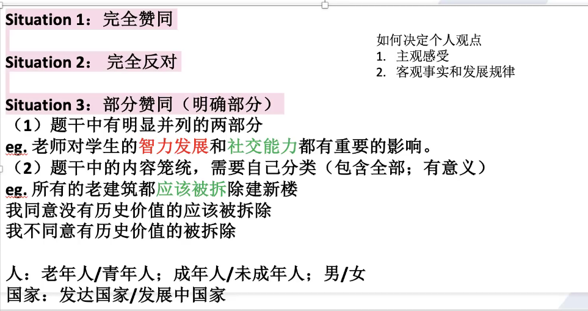
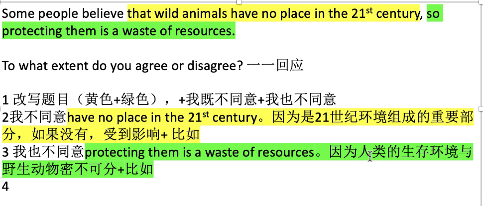
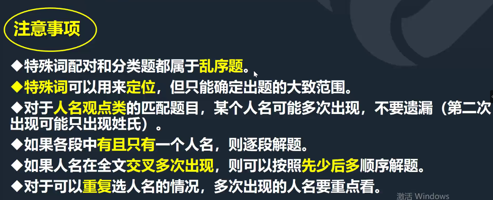
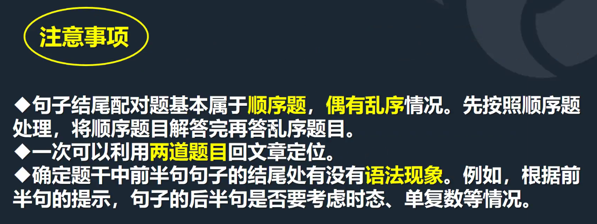
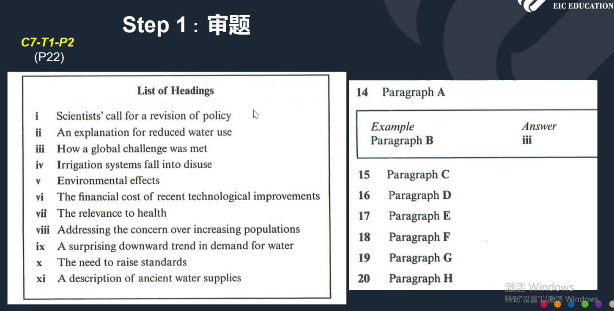
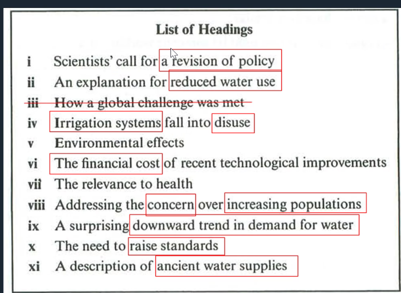

# 写作

中国大陆均分 5.37：语法词汇、评分标准、逻辑

题目设置：图表信息描述 20min+议论文 250 词 40min

## 大作文

### 分类

- 讨论类：Discuss both views and give your opinion?
  - 两个段落一样长
- 观点类：To what extent 程度 do you agree or disagree? Do you agree or disagree?
  - 不一样长 两种不同的问法回答不一样
- 问题解决类：What caused the problem and what solutions can solve this problem?

### 常见误区

- 以类分区：避免跑题
- 用万能模板套题
- 享受舒适圈（使用简单词句，目标凑字数）

### 评分标准

- 任务回应
  - 完成各部分任务
  - 清晰的观点，不能最后更换观点
- 逻辑与连接
  - 语义上的逻辑连贯
  - 每个段落都有一个清晰的中心主题
- 词汇丰富度
  - 试图使用不常用词汇，但有时不准确
- 语法丰富度和正确性
  - 用复杂句式

### 结构

- 介绍段
- 核心段——面向逻辑连贯
  - 问题：没有细节（举不出例子）、不连贯、想说的太多（每个段有一个中心主题）
  - 第一局应当是一个主旨句
- 总结段

### 核心段

核心段的顺序和个人观点有关，观点有偏向一方（任何题目）和缺一不可（如果观点对立 就不能缺一不可），先写反对的，再写偏向的

如果是 Discuss，无论是否偏向，字数差不多，不要带感情。

Discuss：3种 偏向一方（√）、缺一不可

extent：3种 完全赞同 部分赞同 完全不赞同

do you agree: 2种

outweigh：2种 先写缺点 跟2优点

#### 主旨句的书写

1. 审题，找准限定词（对 xxx 来说、在 xxx 方面）
2. 主旨句内容要合理（举办奥运会可以提升国际影响力 因为逻辑不通顺）
3. 简洁明了（不需要写从句），预告写作内容（含有观点）
   - 近二十年科学技术有了发展：描述了客观事实没有观点

#### 主题句的展开

- 原因+举例/对比（明确的结果）
- 举例+举例（说不出原因的时候 明确的结果）
  - 年轻人应该受到重视——一线人员以年轻人为多、创业公司多是年轻人
- 反向假设/让步+结果/举例（意见与建议）
- 细化+举例（抽象的概念）

### 开头段

- People have different views about / People have different opinions about 
- while/although
- I belive that / in my opinion / I would argue that

### 结尾段——个人观点+倡议/建议（凑字数）

### 做题方法

- 审题三遍，画出双方关键词
- 确定个人观点（只影响顺序 不影响内容）
- 快速写提纲，可以不用英语，确定段落顺序（偏向 A则先B后 A， 总结）和大致的例子，5min 内
- 写作（首段有模板，核心段首句，尾段总结）

问程度：100%同意、100%不赞同、部分赞同

部分赞同确定哪一部分，完全的观点不需要写让步段

分类：把人/物进行分类

# 阅读

## 判断题

判断题有 T/F/NG（not given）或者 Y/N/NG，分别都有其判断依据

### True 

1. 题目是对原文的同义改写（题目和原文的信息出现了同义词替换、主动换被动等情况）

   > 原文：Food production has kept pace with **soaring** populations **mainly because of** the **expansion** of artificial irrigation（灌溉） system.
   >
   > 题目：Feeding **increasing** populations is possible **due primarily to improved** irrigation systems.

2. 题目是对原文的合理总结或推断

   > 原文：The metal had to melt at a temperature less than the hardening point of glass(about 600℃), but could not boil at a temperature below to the temperature of the molten glass(about 1500℃).
   >
   > 题目：The metal used in the floated process had to have **specific properties**.

### False

1. 反义改写（题目和原文的信息出现了反义词驳斥）

   - Before---after
   - Almost---totally
   - Always---never
   - 肯定---否定

   > 原文：It is **by no means** the most obvious way to resolve the problem.
   >
   > 题目：It is the most apparent way to resolve the problem.

2. 关系驳斥（对比关系、因果关系、目的关系等相矛盾）

   - More/less/as……as/…….
   - Because /result from/ as a result of/so/result in/…….
   - In order to/ lead to/aim/purpose/…….

   > 原文：The systems supplied the Roman Empire with **as much as** water per person as is provided in many parts of the Industrial world 
   >
   > 题目：Water use per person is **higher** in the industrial world than it was in Ancient Rome
   >
   > 原文：The FAA was created as a result of **the introduction of the jet engine**.
   >
   > 题目：**The Grand Canyon crash** in 1956 resulted in the establishment of FAA.

3. 隐含否定或者通过时态的不同进行表述（Used to do sth/ as was once the case）

   > 原文：She **used to** ask advice from me. 过去常常，现在不再
   >
   > 题目：She **often** get some suggestions from me.
   >
   > 原文：He undertook a task to record the **almost-completed** railway
   >
   > 题目：the railway **had been finished** when he undertook the task.

### Not Given

1. 题干的信息在原文找不到定位词，或者没有提及无中生出一个国家名、时间、细节信息等

2. 无中生出比较关系，因果关系等

   > 原文：Schools are usually **modern** in design, set well back from the road and spacious inside.
   >
   > 题目：Private schools in Japan are **more modern** and spacious than state-run lower secondary schools.

3. 题目可以定位到原文，但是从原文无法得知题目中的事实

   - 原文是某人的目标（aim）、目的(purpose)、愿望(wish)、保证(promise)、发誓(vow)等，题目是事实
   - 原文是并列关系，题目是占比关系
   - 原文是大范围，题目是范围中具体的一个

   > 原文：The new police chief **vows** to crack down on crimes with tough control and iron hands.
   >
   > 题目：The crime rate will be down in the future.
   >
   > 原文：China is the world’s biggest exporter of raw silk **and** silk yarn（纱，纱线）
   >
   > 题目：Silk yarn makes up the majority of silk exported from China.

### 判断题考点词

- 绝对词（Only, all, most, first, always, none, must, 最高级等）
- **比较关系**，因果关系，目的关系等
- 数字（日期， 数量， 百分比等）
  - Increase= soar =burst = ascend =grow= climb
  - Reduce =diminish =decline = decrease= mitigate=dampen=decend
- 细节信息（宾语的替换，主宾位置，范围大小，并列和占比等）

### 易混淆练习题

- 原文：Beijing is **one of the largest** cities in the world.
  题目：Beijing is the **largest** city in the world. **NG**
- 原文：Beijing is the **largest** city in the world.
  题目： Beijing is **one of the largest** cities in the world. **Y**
- 原文：I **used to** play piano very often.
  题目：I **often** play piano. **N**
- 原文：Visitors can travel the park **not only by bus but also by bike**.
  题目：It was found that **most** visitors travel the park **by bike**. **NG**
- 原文：The trees **are native to** Yantai.
  题目： The trees **grow only in** Yantai. **NG**

## 填空题

### 句子填空、笔记题

**做题方法**

- 精读答题指引，看清题目要求（字数限制） 
- 通读题目，判断最容易定位的一道题
- 划出空格所在句中的定位词，迅速找到题目的出处
- 找出文中出题句，根据题干其他信息确定空格答案

**定位**

- 绝对特殊词
  - 数字（百分数、钱数），年份，时间，专有名词/全大写缩合词，斜体，带引号的词
- 相对特殊词
    - 名词＞形容词＞动词
    - 备注：注意误区  标题词汇
- 在通读题目， 划出定位词的过程中，除了题干的定位词，同时要
    - 重视**逻辑关系词**，如 and / both / but / neither 等。这些关系词所表达的逻辑在文章也一般不会发生变化，较为稳定
    - 注意空格前后的语法现象，如词性、单复数等。利用空格前后的词去**推测**空格中词的**词性**，甚至词义
        n.(80%)    v.(10%)    adj./adv./num. (10%)

### 表格、图表标记、流程题

**题目特点**：难度低，出镜率低，送分题

**顺序原则**：展示文章思路和叙述逻辑

**做题方法**

- 精读答题指引，看清题目要求（**字数限制**） 
- 定位：有标题首先用标题定位大致位置
  对于单道题目，使用空格前后的定位词（如名词，数字等）定位。
- 找出文中出题句，根据题干其他信息确定空格答案
- 注意表格，流程，图表标记**是否有标题**

**注意事项**

- 表格题需要注意**表格的表头**，识别单元格信息特征
- 流程图是**顺序题**，注意箭头走向
- 图表标记题需要理解图表**含义和特点以及各种方位关系**（前后上下左右）
- 注意空格字数要求，以及**是否需要填写数字**

### 摘要题

**做题方法**

- 精读答题指引，看清题目要求（字数限制） 
  - 如果是有选项摘要，看一下是否有提及
    NB you may use any letter more than once;
- 忽略空格，通读 Summary
- 划出空格所在句中的定位词，并判断空格词性
- 找出文中出题句，根据题干其他信息确定空格答案
    如果是有选项摘要题，注意正确选项是原文词或词组近义词。

 **注意事项**

- 摘要题分为**无选项摘要**和**有选项摘要**
- 无选项摘要选用原文中的**原词**，注意选词的**字数**限定
- 有选项摘要需要选择和文中词或者词组**意思相近**的选项
- 有选项摘要**不一定是顺序题**，正确选项是原文的同义替换

## 标题题

## 匹配题

填空和判断一般按顺序出题，但是匹配完全乱序

### 特殊词匹配

题目是人名，匹配是观点->去原文找人名，匹配对应观点

地名/国家与解决措施匹配

### 段落信息匹配

信息匹配段落（类似于四六级）

NB（特别注意） You may use any letter more than once 可能重复选择 一般是1个字母选2次，很少1字母3次和2字母2次

- 审题 NB
- 划定位词
- 略读 不要精读 读完一段之后看题
- 比对题目

## 做法

1. 审题
   - 注意乱序
   - 特殊词等对应
2. 分析题目观点，划出关键词
   - 实义名词
3. 用特殊词定位，分析出题句
4. 比对（注意同义替换）

### 注意事项

## 句子结尾配对题

有顺序

### 分类题

类型配特征

# 听力

## 月份的说法

- April the twenty-ninth 
- the twenty-ninth of April
- 29 the fourth

## 拼写

- 答案修改
- 双写 double l double r
- 辨音 uu&w 重音位置, j&g, m&n
- T for Tango

路的说法：Avenue, lane, path, drive, boulevard
时间说法：a quarter past/to am/pm 时间单位不缩写

钱 \$ ￡ € cash check credit card 

钱的数额和题号区分

566222 five double six triple two

0 o zero naught 三种0的说法

z /zed/ /zi-/

字母+数字 postcode passport drivers’ licence 

50A vs 58

P4 生物 商业

限定词、定位词