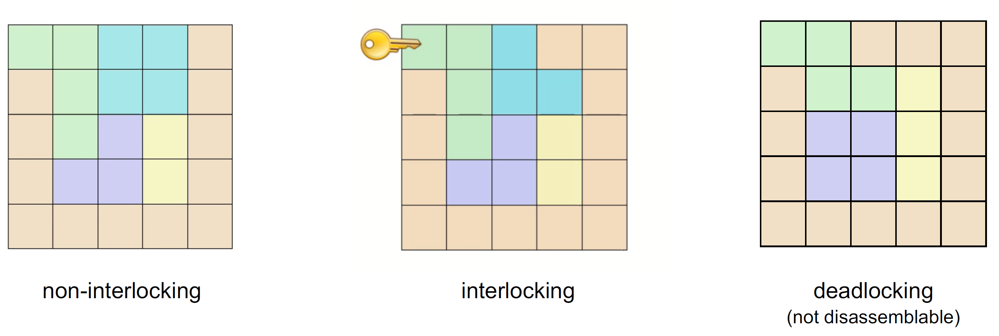
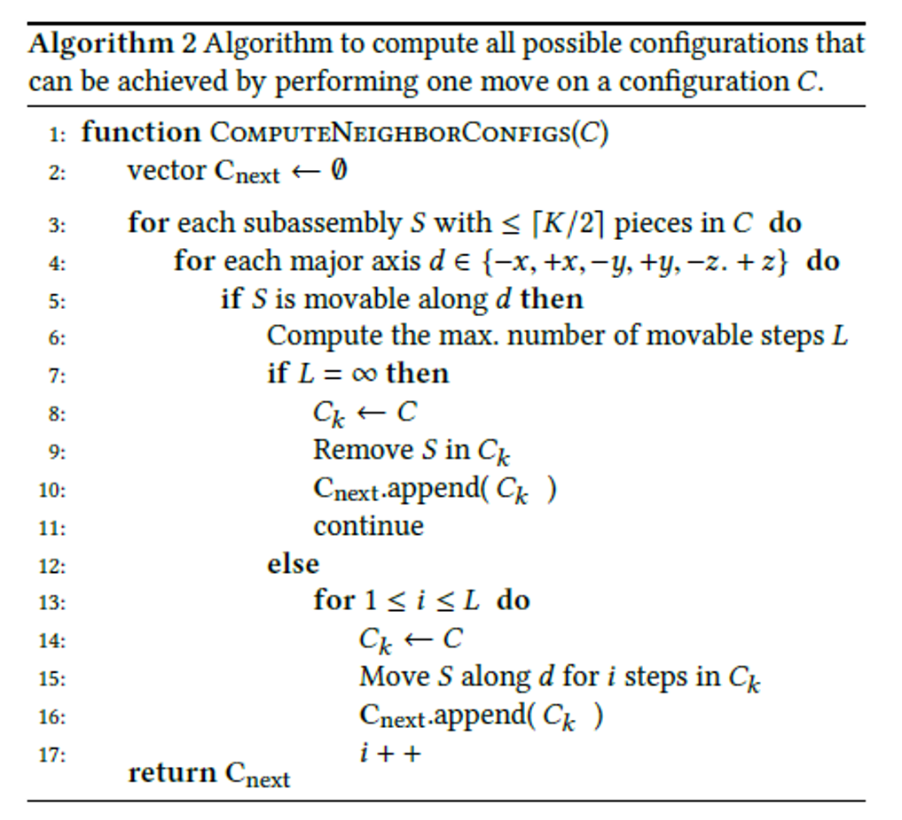
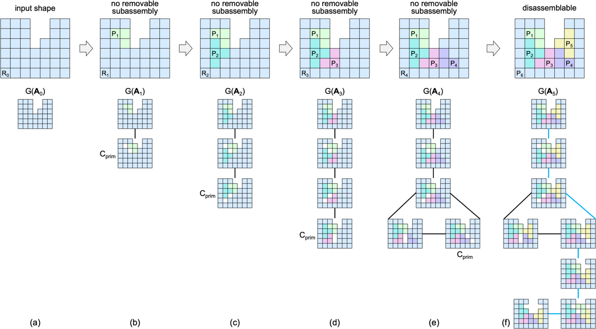

这是新加坡科技大学[宋鹏老师](https://songpenghit.github.io/)组的项目，获得了 SIGGRAPH 2022 提名奖，在创新上还是非常不错的，也非常的有趣。

宋鹏老师在一月前还参加了 Games 的[Webminar 报告](https://www.bilibili.com/video/BV153411G78S)，也是讲述的类似的工作，也欢迎大家去了解一下。

## 谜题与解组装

<iframe src="//player.bilibili.com/player.html?aid=796597593&bvid=BV1VC4y187iZ&cid=220933451&page=1" scrolling="no" border="0" frameborder="no" framespacing="0" allowfullscreen="true"> </iframe>

这是 B 站 Up 主“GM 的秘密基地”关于“圣剑”谜题的解题动画还原，论文中提到的谜题 Puzzle，其实就是指的这些可以在一步步移动后拆解为一块块的个体的过程。

为了方便读者了解相关背景，在这里先科普一些背景知识（来自于宋老师组在[Eurographics 2022](https://eg2022.univ-reims.fr/)上的[tutorial](https://sutd-cgl.github.io/supp/Publication/projects/2022-EG-AssemblyTutorial/index.html)）。

关于这种谜题，学术界通常将其与组装 Assembly 归为一类问题，并把解开谜题的问题列为解组装问题 disassembly。组装的话每个物块之间有不同的连接方式，按永久性来讲，分为永久和临时的连接；按接触形式来讲，分为用摩擦力固定的连接和支持力固定的连接；按连接方式来讲，临时的连接还分为内在 internal（结构形状决定）和外在 external（使用非连接部件的第三方部件进行连接）……

组装问题中，学术界还会去研究两个物块之间接触面的几何特征，来约束物块之间的相对位移（该工作出自 ZIQI WANG 于 2021 年 SIGGRAPH 的[MOCCA 论文](https://dl.acm.org/doi/10.1145/3450626.3459680)，通讯也是[宋鹏老师](https://songpenghit.github.io/)）。

当然上面那篇论文更重要的贡献是在结构稳定与平衡方面。论文对输入的物体给出了设计每个块的方式，使得在组装的时候组装比较容易，这个工作非常有意思。

## 解组装 Disassembly 问题的常见分类

前四个分类是描述组装问题难度的重要指标，后面的论文中我们还会遇到。而自锁 interlocking 是描述一个组装的重要特征，也是一个重要的分类。

### 顺序性 Sequentiality

> Maximum number of moving sub-assemblies w.r.t one another in any (dis)assembly operation

个人理解的顺序性指的是每个物块（组）可以从整体中按一个方向取下，不存在需要一次性需要两个物块按照不同方向同时用力才能取出的情况。从图片中我们可以看出来，上方的组合可以用两只手解决，而下方的需要三只手（两只手移动下面两块，一只手用来固定）。

### 单调性 Monotonicity

> Need for intermediate placement operations for at least one part of the assembly

个人理解的单调性指的是某块物体的取出需要其他物块的移动，从而在操作顺序上存在了一个偏序关系。从图片中我们可以看到，上面的图片移动蓝色还是绿色都是无阻挡的，而下方的组合需要先把绿色块移走才能把蓝色的块取出来。

### 线性性 Linearity

> All assembly operations involve moving a single part with respect to the rest of the assembly

个人理解的线性性指的是组合可以一块块取出。从图片中我们可以看到，上面的图片中蓝色块和绿色块可以独立取出，而下面的需要把蓝绿两块作为整体取出。

### 相干性 Coherence

> Whether or not each part that is moved will touch the rest of the assembly

个人理解的相干性指的是每个物块的移除对当前状态是有影响的。从图片中我们可以看到，上面的图片由于是一个整体，某块的移除对当前状态自然是影响的，而下面的图中，移除了绿色块后，自然地形成了左右两部分，左边块的移除自然不影响右边的状态，所以这一块是不相干的。

### 自锁 Interlocking

> An assembly is interlocking if only one movable part (key), while all other parts, as well as any subset of the parts, are immobilized

个人理解这里说的自锁描述的是组合可解，而且活动块只有一块，这一块取出后其他块才可以移动取出。从图中我们可以看到，左图中绿色和蓝色都可以直接取出，中间的只有绿色的可以取出，绿色取出钱其他块无法取出，右图中每块都不能正常取出。这也意味着这种结构存在一种稳定性，只要锁住活动块 key，就能保证整个结构是稳定的。

## High Level Puzzle

### 贡献与创新

论文主要有以下几个贡献

- 给出了难度等级的准确定义，并给出了一个求解每个谜题难度计算的算法（虽然是 NP 完全的 BFS 算法）
- 给出了用于构造每一个块的迭代计算算法，并让难度维持在输入的难度上，此外还给出了基于已有迭代结果构造更大难度的 puzzle 算法
- 给出了将非立方体体素的物体进行形状优化，转化为规则体素结构的方法

理论上，pipeline 应该是**先把 Mesh 网格进行优化，优化为可以打印的体素表示，再对体素进行分块处理**。不过为了与论文同步，我们接下来我们将依次介绍每个贡献。

### 难度等级与难度计算

那既然叫做 High Level，那怎么去定义一个谜题的 level 呢？论文给出了业界常用的两个计算方法——按第一块取出的最少移动步骤数以及所有块相互分离所需的最小移动步骤数，并选取了前者作为论文所关心的难度指标（毕竟拿掉第一块之后可能后面的块拿出就会简单一些，当然这也确定了论文讨论是满足单调性 Monotonicity 的 puzzle，否则难度就是 1 了）。论文对此进行了详细的描述：

- 无论一次移动几个块，只要是按照一个方向同时移动，记一次移动
- 移除某个块记一次移动
- 一块无论移动多长的距离，记一次移动

而难度计算其实就是一个平凡的 BFS 方法，每一次设置一个状态，以状态和移动的关系构成一张无向图。在图中节点分为根节点（初始状态）、普通节点和目标节点（成功移除一块），而初始状态到目标节点的最短路径的边数正是难度等级数。这里我把论文中的伪代码贴在下方，就不再展开介绍了。

值得注意的是，对于 K 个物块来说，运动超过一半的物块相当于剩下的物块进行移动（运动的相对性），所以在枚举物块数量的时候不需要让单步移动的物块数超过一半$\lceil K / 2 \rceil$。

除了盲目的搜索以外，我们还要考虑到无解的情况，因此论文也给出了一个伪代码来解决问题无解（主要指的是上方 deadlock 的情况）。

### 谜题构造

如图所示，本节介绍的是迭代生成每个物块的方法。论文对生成的物块有以下的约束：

- 几何连通性：需要保证每一个物块的体素都是六连通的
- 大小均匀：需要保证每一块既不是太大又不是太小，设允许误差为$\delta$，总体素数为$M$，物块数为$K$，则约束每个块大小在$[(1-\delta)\lfloor M/K\rfloor],\ (1+\delta)\lfloor M/K\rfloor]$范围内。
- 块的可移动性：正在设计的这一块是可以移动的
- 子问题不可解：选择的前一状态是不可解的，否则就变成了并行的问题，难度并没有增加
- 最终结果可解：不然就设计了个寂寞

其实设计每一块，总的来说就分为**设计第一块**和**从一个状态设计下一块**的问题，我们将分别进行展开。

#### 设计第一块

第一块来说是相对麻烦的，我们要设计一块可以移动但是不能直接移除的一块，设计方法如下：

- 确定一个移动方向，来确定有那些块可以被移动。如图 a 和图 b 所示，当选择向左还是向右时，既要满足块可以移动而且不能直接移除的体素被标记为 S，而阻挡他们按此方向移除的体素被标记为 T。
- 从适合的体素中随机选一个（通过设置随机种子进行随机），作为块的一个体素。
- 通过设置阻碍对，保证选出来的块只能沿着选择的移动方向移动~~（草怎么引用的这篇论文还是宋老师团队的，还是 2012 的 SIG ASIA）~~
  - 如图，图 a 的红色体素有向上和向左两个移动方向，而我们希望限制其向左移动
  - 我们会选择限制方向的一对体素（图 b 中的任意蓝色圈都可以作为这一对体素）作为阻碍对
  - 让阻碍对目标方向侧的体素作为阻碍体素，让红色体素与另一个体素最短路相连（但不能包含阻碍体素），就像图 c 一样，使得红色块无法向左移动
  - 但是图 c 现在也不能向目标方向移动了，我们则扩展块使其可以向目标方向移动，得到图 e
- 在对满足上面条件的块进行增补，使得块的大小满足上节的约束条件

#### 设计其他块

我们设计其他块，其实是有意让难度增加（也是子问题不可解），所以我们尽可能地在已有 puzzle 状态中离根节点最远的节点进行扩展，以免难度不变或降低。

其他的与设计第一块是类似的，在设计完所有块后判断一下是否满足输入要求的难度等级，不满足则继续递归求解（所以是一个复杂度特别大的算法）。

#### 提高谜题难度

论文发现直接通过迭代去构造满足比较大难度的谜题，需要的时间成本太高，所以他们分了两步走——先构造低难度再通过调整提高难度。具体操作如下：

1. 选择邻居块相对少的体素
2. 把它加到随机选择的邻居里
3. 计算新难度
4. 如果难度增大则保留修改，否则还原修改

### 形状优化和体素化

对于一个 Mesh 表达的物体，不是总能无瑕疵地分为体素，如果是对于没有完全填充结构的体素，则可能会导致一些断裂之类的的打印问题。因此如何更好地对形状进行优化，以适合的方法进行体素化，是一个比较重要的问题。所以论文提出希望牺牲一部分的形状精度，通过一些小变形来解决打印问题。

对于一个 Mesh $M$，其中的点集为$V$，面集为$F$。如果用户给定的体素边长为$\mu$，则可以把体素分为三类——填充满的体素、部分填充体素和空体素（如图 a）。而论文定义有问题的体素是部分填充率小于 10%的体素。因此，论文提出优化目标$$\mathop{\min}_{\boldsymbol{t}, w, V} E_{\mathrm{voxel}(\boldsymbol{t}, w, V) + \lambda E_{\mathrm{shape}(V)}}$$，其中$\boldsymbol{t}$是物体相对于中心点的位移，$w$是等比缩放率，$E_{\mathrm{voxel}}$是问题体素数量，$E_{\mathrm{shape}}$是维持形状的能量，$\lambda$是权重系数，而$E_{\mathrm{shape}}(V)$的计算使用的是**尽可能刚性**的形状维持能量计算公式。

这个优化问题存在两个问题：$E_{\mathrm{voxel}}$梯度不好求，以及$E_{\mathrm{voxel}}$的参数$t, w, V$范围太大，不可能完全采样。为了解决梯度的问题，论文提出了一个外壳 S，是从原填充满的体素（不含部分填充体素）向外拓展$a \cdot \mu$和$\mu$中间所夹的区域（见图 b 中黄色和绿色线所夹区域），而$E_{\mathrm{voxel}}$则定义为面片到夹层距离$E_{\mathrm{voxel}}(\boldsymbol{t}, w, V)=\sum_{F_i\in F}(\mathrm{dist}(F_i)(\boldsymbol{t}, w, V))$，通过这样的方式来细化梯度的求解，使得梯度方向为目标优化方向。而范围问题，论文选择了两阶段法进行考虑——先固定$V$，对于$\boldsymbol{t}, w$的四个自由度进行随机采样，然后固定$\boldsymbol{t}, w$，使用 L-BFGS 方法优化 V。

### 工作的效果

这是论文工作的效果，上方是体素表示，下方是实物展示。此外论文给出一个表格来表现工作的情况（见下表），第三列表示是否为光滑表面（需要使用形状优化算法），第四列为体素化的分辨率，后边的列分别为**孔洞体素（为了游戏块可以移动设计的，后面还会提）**数$E$，谜题块数$K$，难度等级$L$，在第一个贡献中的无向图里计算出来的状态数$G_N$、边数$G_E$、目标状态数$G_T$（目标状态数越多表示解开谜题的方法越多），是否二次修改难度$\mathrm{Modify}$，以及程序计算（不含形状优化）的时间$\mathrm{Time}$。

此外，论文与 2020 年的工作相比，同样都是对于立方体进行谜题设计，他们就可以生成更高难度的谜题。

下面的是他们的一些结果，其中左图表示在$K$块、难度为$L$的谜题中，程序计算的时间，右图是实际结果的展示。

此外，论文还展示了其中一个边长为 6 的立方体，解开第一块需要 27 步，其中每一步的移动如图所示。

## 尾记

年初看到学长在讨论班里讲宋老师去年 SIGGRAPH 那篇平衡性的论文，于是这次就用了些时间来跟了一下宋老师的工作。当我运行代码，发现 run 不起来的时候，还给作者陈学长发了一封邮件。其实也是第一次发邮件来请教论文的问题，英文的邮件打磨了好久，最后收到了“加个微信吧，这样交流起来方便”的中文回答，还是感觉学长蛮实在的，非常的意外 2333。

其实这个工作还是很不错的，美中不足的地方是，论文其实并没有提到如何选择谜题中孔洞体素的选择方法，也没有对孔洞数量对设计难度的影响进行定量的分析。此外论文给出的设计问题的复杂度是$O(K^N\cdot N^{2K})$，也能看出来是个 NP 问题，其中$K$是块数，$N$是实心体素数。这意味着论文给的方法基本上只能解决$K \le 8$且$N \le 1000$的输入，这个输入规模还是非常有限的。

没想到，从 2012 的那篇 SIG ASIA 看出，宋老师的课题组已经在这个项目耕耘十余年了，对于喜欢新问题的 SIGGRAPH 来说，每篇论文对他们来说都是一个挑战。祝宋老师的课题组做得越来越好，也期待之后能与他们有合作 qwq！
