这是SIGGRAPH Asia 2021 的论文，也是ACM Transaction of Graphics的论文。其实基础的MC算法也是图形学常用底层算法之一，研究研究也挺好的~

PPT：https://icys.top/reveal-0406/

## 起源——Marching Cubes

说到Marching Cubes，朋友给我发了张图，表示这就是Marching Cubes（图片来自于YouTube Code Adventure频道）。

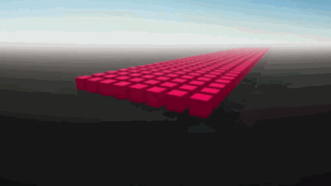

Marching Cubes （通常缩写为MC）算法是1987年发明的等值面提取算法，也是迄今为止使用最多的提取方法。当时原论文利用原始的三维数据推导内切片的连通性、表面位置和表面梯度，通过分而治之，得到相对高质量的结果。

>  MC算法把按均匀晶格（Grid）采样的隐式场作为输入，并提取表示场的零等值面的三角形网格（Mesh）。

在图形学中，曲线曲面等的表示，分为显式表达和隐式表达。显式表达就是能写出一个类似于$z=x^2+y$的表达式，其中一个维度作为因变量，其他维度作为自变量，可以写出一个等价的关系，而隐式表达则是类似于$F(x, y, z)=0$的形式。从显式表达到隐式表达是非常简单的（移项就有了）。一些例如球、椭球等曲面就又可以显式表达也可以隐式表达，但是更多的复杂的曲面是很难有其显式表达的，我们就常用一个隐式距离场来进行表达，即对自变量组成的线性空间进行均匀间隔采样，通过三线性插值（在X、Y、Z坐标依次按顺序进行插值）来确定这个隐式表达的面。

在图形学中，三维物体常用Mesh结构表示，结构将连续的表面离散化，用多个三角面片（有的会用多边形）来表示曲面，这样会造成一定的精度误差。因此各种方法就是在尽可能地向准确值逼近，以更好地还原物体。

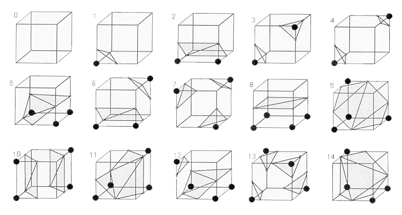

1987年发明的MC算法是最经典的做法，它通过检测一个立方体对应的八个顶点的符号，结合已有的预定义查找表格（在去除对称、旋转等变式后，论文总结出15种情况），确定这个立方体中的Mesh表示。当等值面与立方体边相交，将该边线性插值的点加入最后的顶点集合中。立方体一步一步依次移动（或者说前进March，这也是为什么叫做Marching Cubes），最后得到整个物体的面片结构。

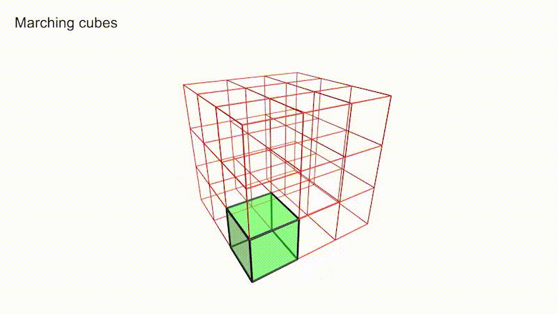

## 改进——MC33

基础的MC算法在计算的时候，由于过度的分而治之，导致相邻两个立方体的面片结构不连续，使得生成出的结构带有孔洞（见下左图）。此外，基础的MC算法无法形成管道结构，对于真实物体的还原性有限（下右）。基于此，1995年，Chernyaev发表了MC33论文，对已有的MC算法进行优化，以保证拓扑的正确性。

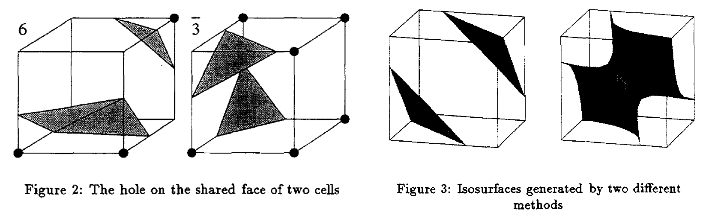

MC33的论文假设每个立方体的顶点不仅限于正负，可以使用三线性插值（按三个方向依次插值）以精确最后得到的结果。这篇论文发现，原来的15种结构中，平面内对角相同的2正2反正方形有两种（一个原象有两个象无法形成映射关系），称其为`Ambiguous face`，并且在相同立方体排布下仍可能存在多种情况，称其为`Internal Ambiguity`。

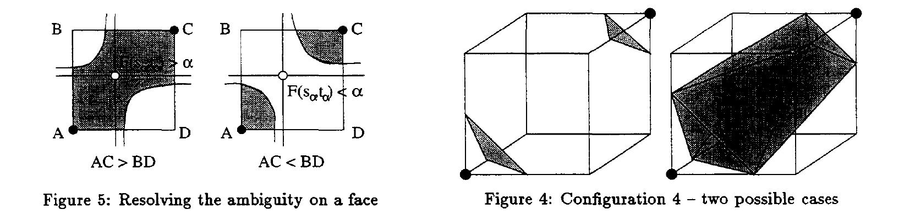

为了解决上述问题，确保在三线性插值基础上的拓扑正确性，论文细化了分类，将当前状态与相邻立方体结构情况相结合一并考虑，得到了33种立方体，具体结构如下：

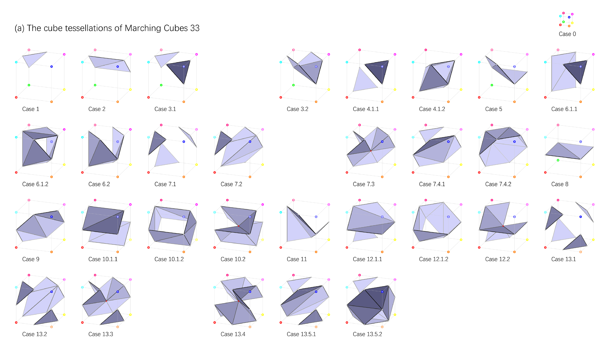

## 主菜——NMC

在若干年的发展中，MC方法修修补补，但仍没有完全解决一个比较棘手的问题——MC算法对于尖锐边缘的还原性不佳。近期有一些算法可以解决尖锐边缘问题，但是需要额外的输入。

于是自称加拿大最强的图形学高校SFU~~（况且称呼它为顺丰大学）~~的张皓团队，提出了深度学习的MC算法NMC，设计了兼容于传统MC算法的立方体结构表示方法，修改了一部分镶嵌方案（加入了一些隧道的情况），设计数据集并使用有监督的深度学习（基于ResNet网络模型）代替MC33的三线性插值方案，以获得更好的（尤其是可以更好表现边缘锐度的）物体重建效果。

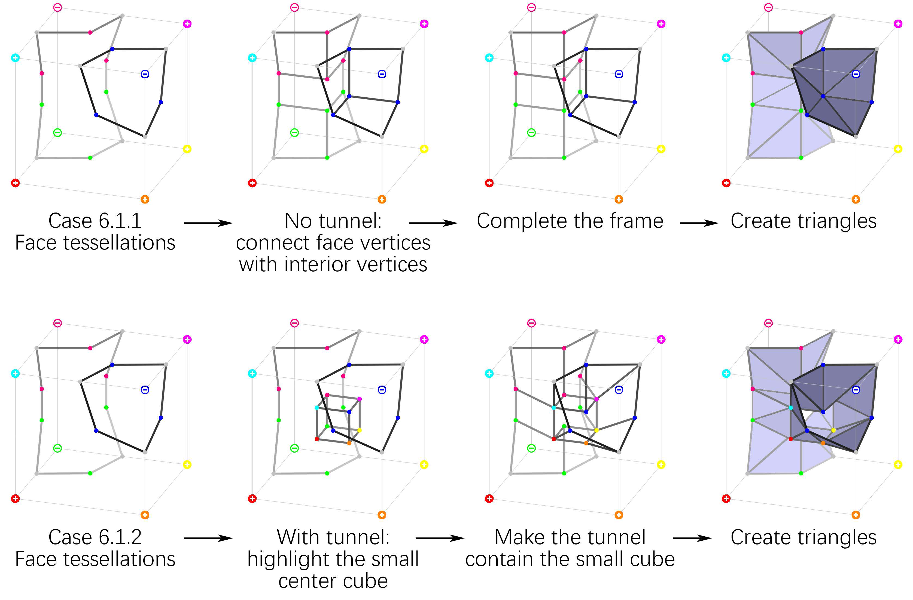

### 效果预览

除了论文宣称的边缘锐利明显以外，可能有些（审稿）人会问，这个方法为了解决表现锐度边缘问题，那对于比较平滑的表面，效果怎么样呢？论文在补充材料里给出了效果对比（每一列的标签在图片最下方）。

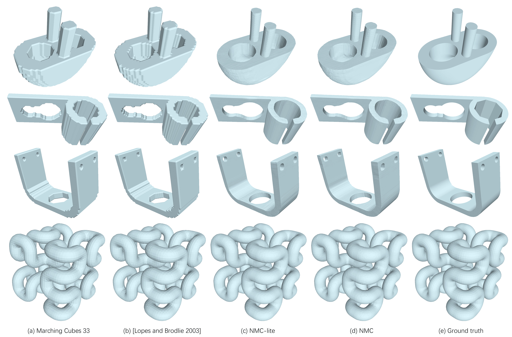

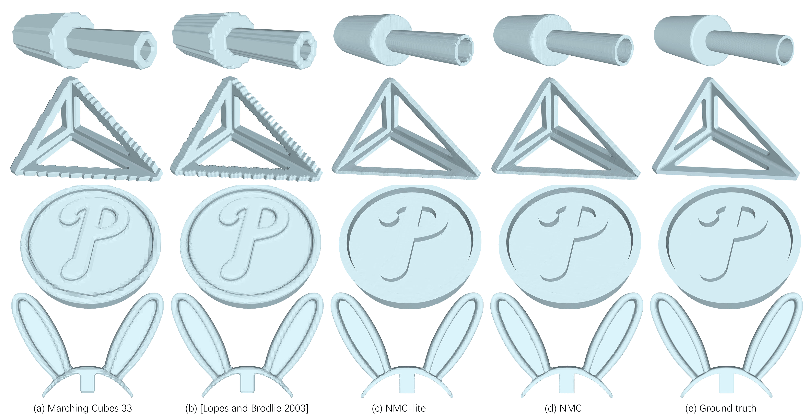

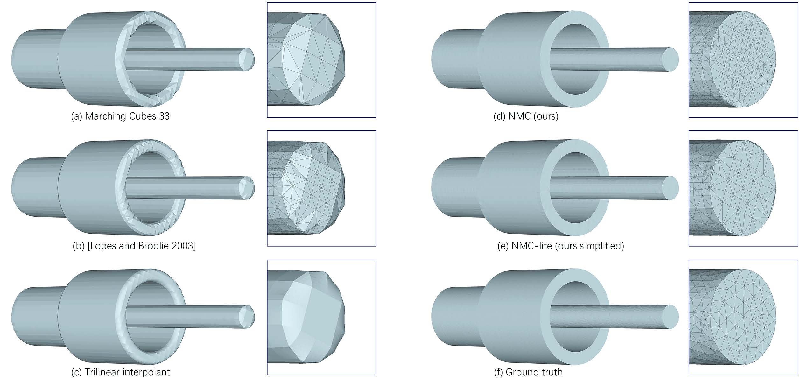

### 表示输出的Mesh结构

我们很希望深度学习网络输入一个隐式距离场（其实论文还可以输入体素结构），输出一个Mesh，但生成Mesh不太现实，那如何用深度学习网络的输出表示Mesh呢？

有一个Naive的表达方式，使用One-hot Vector表示每个立方体单元是每种镶嵌情况的概率，这样会使得训练效率非常低，而且不太好表示旋转对称等（否则会让向量的编码更长），不是一个明智的表达方式。

论文提出了一个新的表达方式，它从二维进行举例，并顺其自然地扩展到三维。对于MC算法的二维情况，论文在正方形中间加入四个自由的点，根据四角点的正负情况，这四个自由点会有1至2个点有效，参与形成的Mesh的顶点连接。此外，论文摒弃了传统的线性插值方法，将四条边上各加上一个有自由度的点（现在一共有$4+4=8$个点）。此时，对于一个正方形的嵌入方案，需要5个布尔值表示分别表示四角的正负情况和对角情况的正负面情况（刚才说一对二无法形成映射，则对于这种情况额外加一个布尔变量进行区分），还需要12个浮点数表示八个点的自由度（四条边上的点各有一个自由度，而正方形内的点各有两个自由度，共有$4\times1+4\times2=12$个自由度）。

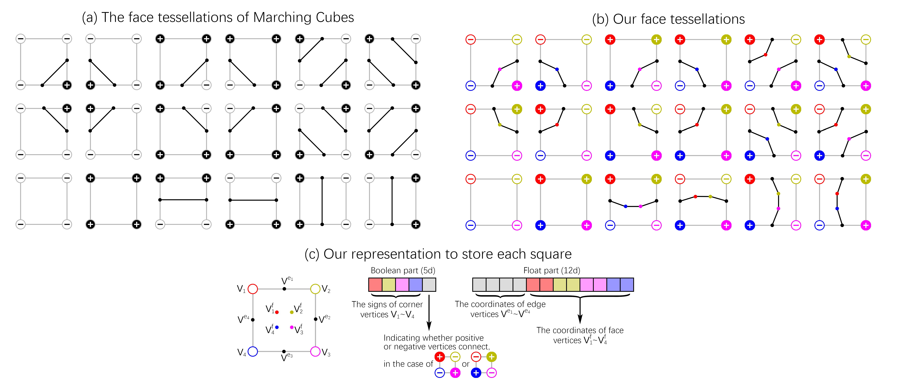

由于正方形不是独自存在，相邻正方形共用一边，一个顶点至多被四个正方形共用，故我们在表达时只表达每个正方形左上角顶点，以及上、左两边（最后一行一列加空padding就行了），这样一个正方形需要两个布尔值和10个浮点数进行表达（正方形内的点没有被共用）。

扩展到三维的时候，与二维同样的，每条边有一个自由度为1的点，每个面有4个自由度为2的点，此外还有体内8个自由度为3的点。此时表示一个立方体需要15个布尔值，分别表示8个顶点正负、6个面朝向（同正方形面朝向、仅在对角相同的情况使用）和一个Tunnel flag（与MC33相同，表示这个格子内是否存在隧道。因为论文仅考虑出现一个隧道的情况，所以只需要一个布尔值），需要84个浮点数，分别表示84个自由度（$12\times1+6\times4\times2+8\times3=84$）。同样地，删节后，需要存储5个布尔值（1个顶点、三个面和隧道标志）和51个浮点数（$3\times1+3\times4\times2+8\times3=51$）。

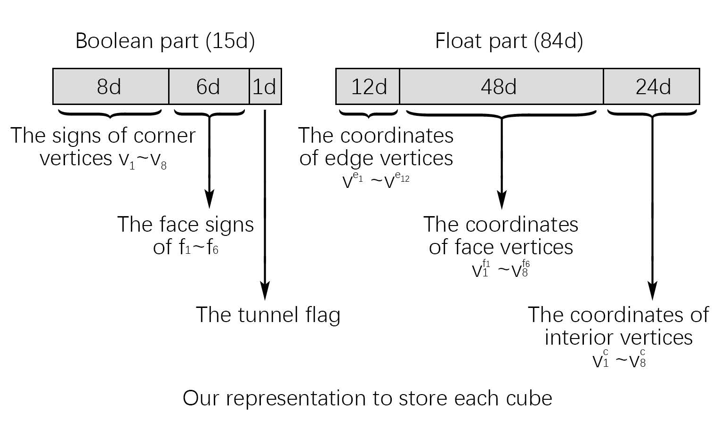

一个立方体八个顶点的数据已经编码成功，而论文对这样的数据与镶嵌模式进行对应时，也扩充了原有的情况数，在2003年的论文（对MC33进行了一定的修正）基础上，添加了6种管道类的镶嵌方案，被他们称作NMC-lite，而他们基于NMC-lite重新设计的结构叫做NMC。可能有人会好奇，$33+6=39\neq37$，那少的两种情况去哪了呢？这两种在论文中与其他的结构表达合并，故少了两种结构。

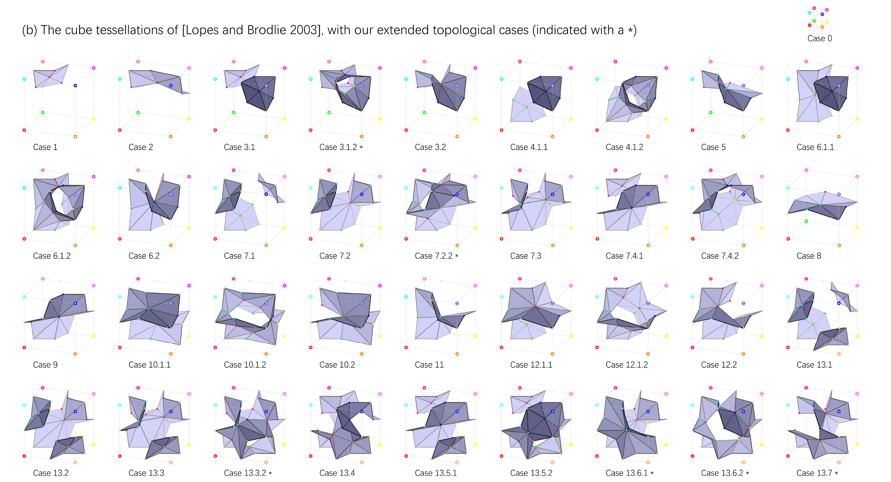

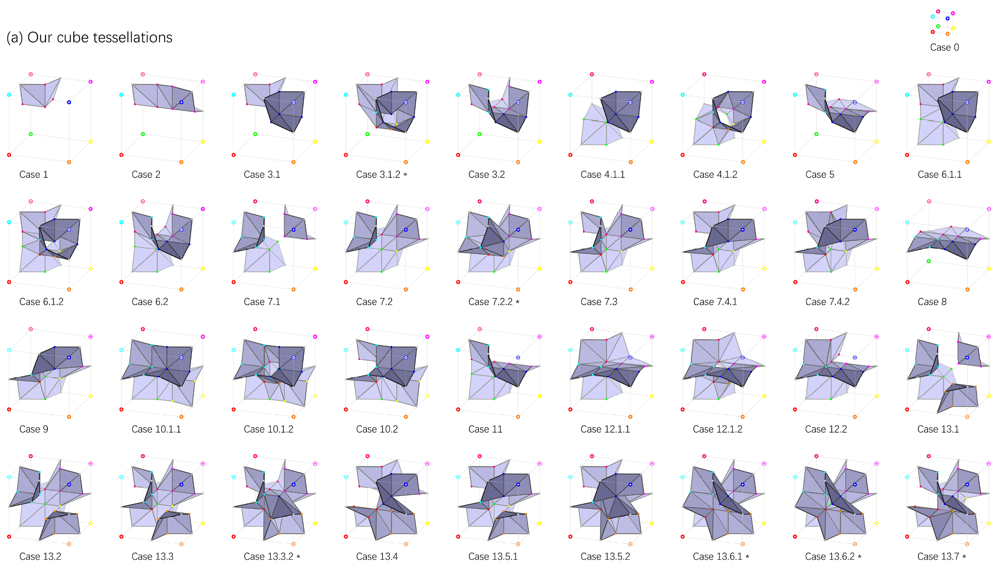

### 数据集的设计

由于网络需要输入距离场或体素，输出布尔值和浮点数向量，他们将物体按分辨率切分，对于每一个小立方体，按照以下次序去得到布尔值和浮点数的真实值（Ground Truth）：

- 确定拓扑类型（布尔比特）
  - 使用$9\times9\times9$的采样，判断各点正负，得到隐式距离场
  - 通过采样的隐式距离场，判断每个面的顶点的连通性（相邻的采样点符号相同为相连）
  - 通过检测立方体内部的连通块数量，判断是否有隧道，以及判断是否能表示
- 立方体与物体求交，获得所有立方体每条边与物体的交点（如果有）
- 对物体与立方体表面的交采样，确定所有立方体面片内点的位置
- 对物体与立方体的交进行采样，确定所有立方体内8个点（如果需要）的位置

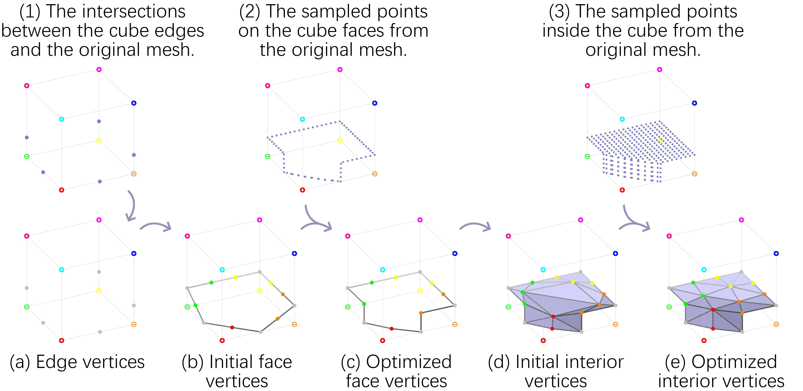

### 深度学习网络相关

其实这篇论文并没有对深度学习网络进行优化，更多的贡献在于架构了几何表达到网络输入输出的结构关系。

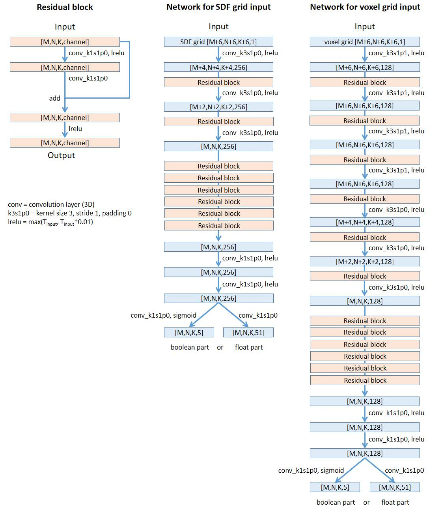

- 网络：3D ResNet
- Loss函数
  - 对于布尔值结果使用BCE（Binary Cross Entropy）
  - 对于浮点数部分使用MSE（Mean Square Loss）
  - 如果输入是voxel，为了让结果光滑，在浮点数部分Loss中额外加了光滑性loss（对于Ground Truth中的长度较短的Mesh中的边，计算其在预测模型中的长度。由于镶嵌模式是另一个网络计算，可以保证预测和真实模式相同，使得边是能对应的上的）
- 由于BCE和MSE的Loss权重不好设置，故用两个网络分别计算布尔值和浮点数

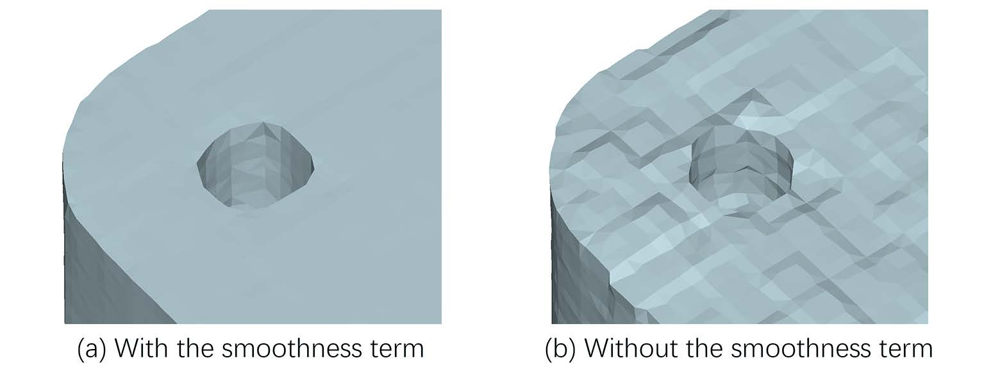

### 效果比对

1. 论文其实给了许多的客观的评价指标，但是由于过于专业，本文仅从主观判断的角度展示结果。
2. MNC的效果在所有分辨率的情况都优于MC33，但是随着分辨率的增长，NMC与MC33的差距会逐渐减小，因为每个立方体的拓扑情况会简化。从图片上来看，NMC的结果与MC33下一个精度的结果接近。
3. NMC比MNC-lite效果好一些，但是三角形的数量要翻一番。
4. 对于噪声的处理：如果把噪声的数据以正常数据的比例放入训练集和测试集，训练得到的模型效果会有明显的改善。

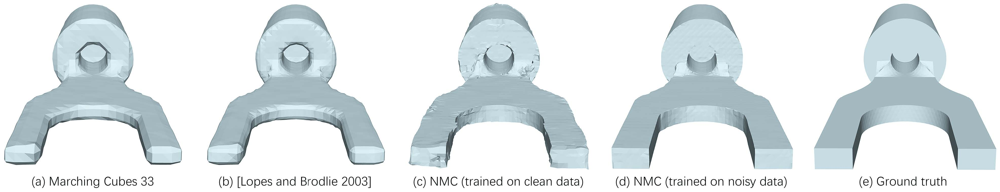

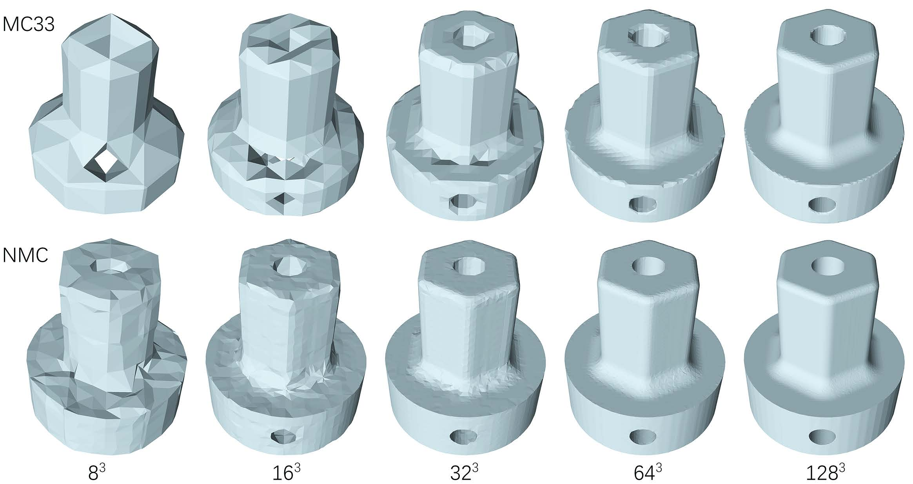

### 缺陷和未来工作

1. 网络对于旋转是敏感的，因为他们训练的数据集的物体大多与坐标轴对齐，于是他们写的平滑项loss会驱使着向坐标轴对齐。

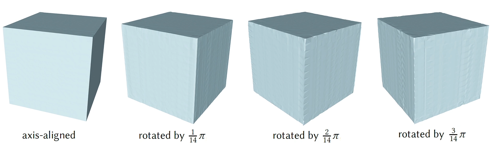

2. 对于某些拓扑结构，匹配不到对应的镶嵌模板（主要是分辨率不够，使得拓扑结构复杂或极端）

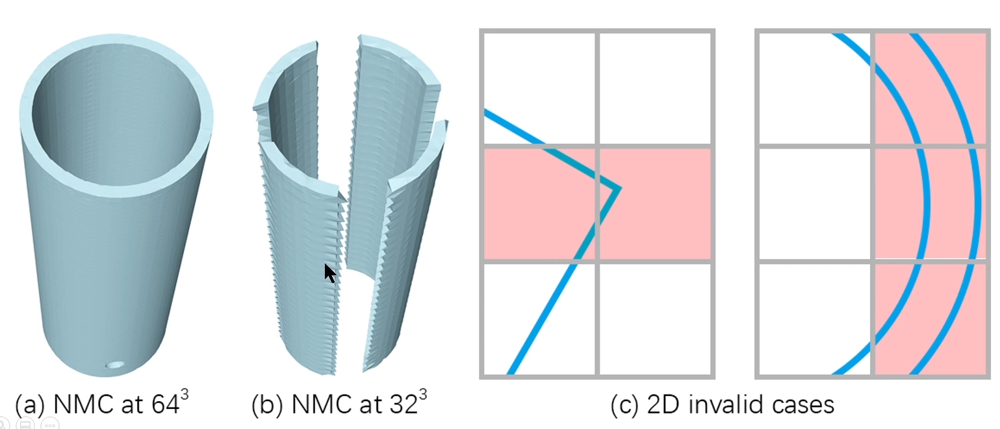

3. 某些匹配不成功的立方体，所计算的结果可能有自交叉。

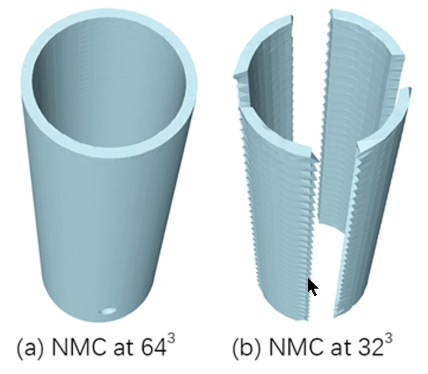

