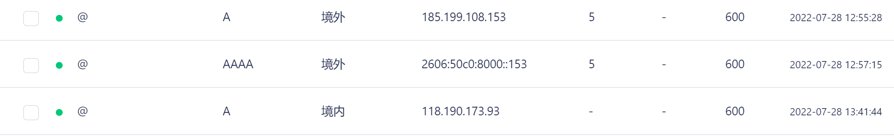
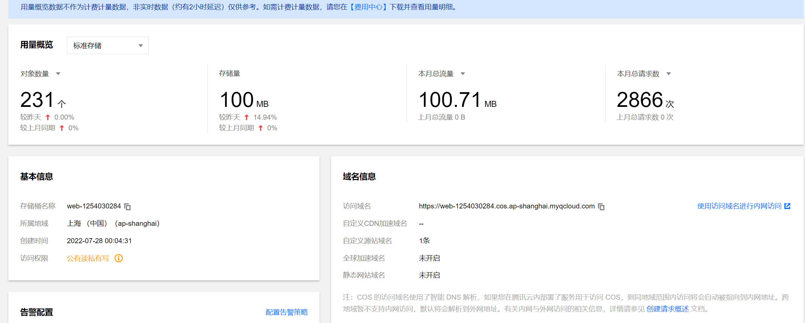
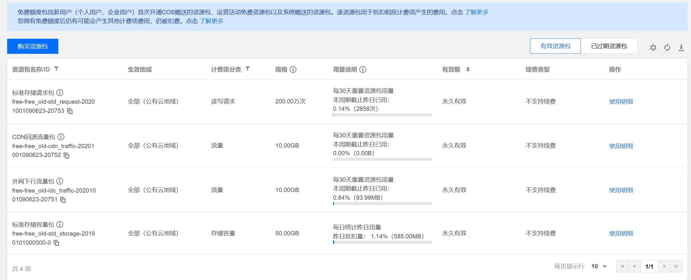
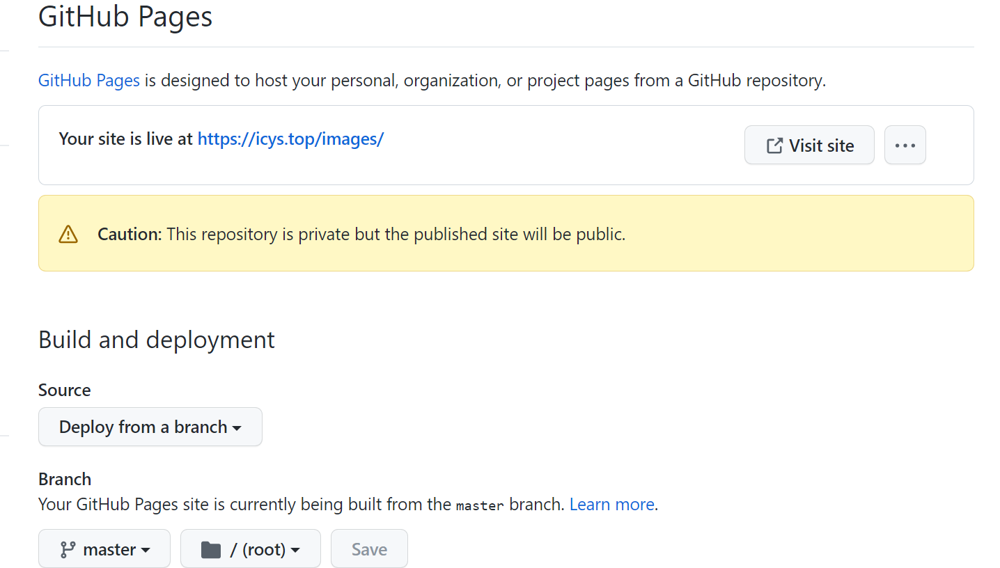

每年寒暑假，我都会去倒腾倒腾博客的搭建问题，上一次的全站加速存在着可能的几个问题：

- 对于更新的同步来说太慢了，导致修改后还得手动到后台“刷新预热”处清除各部署单元的缓存
- 全站加速的境内境外分别计费，资源包不互通
- 在博客访问少的时候，CDN节点也得回源到GitHub，还是挺慢的

所以有没有一种方法，对内对外都可以用起来很方便呢？在研究域名解析的负载均衡后，我选择了国内国外分开解析的方法——国内直接解析到自己的服务器，国外解析到GitHub Pages，就可以了。



一开始觉得，这有什么难的呀，改改解析就完事了，后来发现博客的图包太大了，部署起来费事（因为从GitHub克隆仓库，带宽时高时低），再加上服务器是1M小水管儿，所以这次我用上了云服务中吹来吹去的**对象存储**来托管图片的存储~~（对哦，没有对象存就new一个诶）~~。



顺便在这里提一句，腾讯云的对象存储对于新用户赠送180天50GB的存储（但是流量费、请求费少不了），但是我看了一下我的免费额度，好像对于我当时那批用户，腾讯云给的额度好像不局限于存储诶，还是永久免费的。庆幸高一的时候，我就已经整起腾讯云这东西了23333。



对象存储首先需要在云服务商控制台创建桶，设置好权限（记得设置防盗链，以及关闭空referer支持），设置好自定义域名（其实是换cdn方便，因为到时候只要改解析就好了，不过坏处是要设置SSL证书，各有利弊吧）。

由于本站的图片都在`/images/`目录下，于是一个非常简单的想法就是把这个目录302出去。

```
    location /images/ {
      rewrite ^/(.*) https://imgcdn.icys.top$request_uri redirect;
    }
```

因为我也不喜欢存储桶里图片堆在根目录下（不好清理），所以我在存储桶里还是建立了一个`images`目录，这样在跳转的时候就省事了。

但是国内外如果我都使用国内节点可能带来国外图片速度下降问题，再加上Pages也没有302支持，于是还得考虑一下国外的图片处理问题。然后我发现，好像我可以选择建一个叫做`images`的仓库，开启Pages后就自然而然的就是`icy-blue.github.io/images/`（配置CNAME之后就是`icys.top/images/`），自然而然地就可以不用302了，真的是方便。



于是，对于图片的处理，可以在本地`images`目录新建一个仓库与GitHub同步，这样本地编辑markdown的时候写`../images/xxx`也能找得到，计划再在`images`仓库设置`Action`对新图片自动同步到腾讯云，这样就实现了一个比较优秀的图片加载问题。

-------------------------

对了，刚打算收工，就发现GitHub对于Pages的更新[GitHub Pages: Custom GitHub Actions Workflows (beta)](https://github.blog/changelog/2022-07-27-github-pages-custom-github-actions-workflows-beta/)。大概说的是，Pages的输入可以不是一个分支了，可以直接用Action打好的tar包去部署，省的像我，先建立一个`icy-blog`仓库，再通过Action生成到`icy-blue.github.io`仓库，就可以一步到位啦。看看暑假有没有空做，不行等寒假再搞搞~