# 综述报告-浅谈云计算

> 本文仅代表作者个人观点，文章内容使用 MIT 许可协议，[pdf 版本](../files/云计算paper.pdf)可能会有更好的观感体验。
>
> 本文用时约五天，共占 ACM 双列模板 11 页（含参考文献，课业要求 10 页），行文仓促，如文中内容错误欢迎[联系我](mailto:i@icys.top)，本人不胜感激。

## 摘要

随着越来越多的网络平台选择了云服务商的云计算服务，云计算这个词汇在人们眼前出现的频率不断增加。在科技发展之中当代云计算也有了许多的新面貌，我们可以轻易获取许多高质量的云计算服务，也可以看到现代云计算服务的现状与其在网络平台中的应用。不过，发展中我们也遇到了延迟、低利用、高能耗、高干扰等挑战，目前许多学者正在研究攻克这一个个难题。

## 介绍

从 19 世纪 40 年代开始，计算机开始诞生，到 80 年代个人计算机变革，再到 2000 年开始的互联网变革，最近几年云计算这个话题也变得异常热门。我们使用的云计算，产生的互联网平台，更好地将过去一些过时的管理方式变到云端管理，负责人员随时随地都可以收到相关的告警信息，从而能够及时联系相关人员排查。以电费缴交为例，从人工抄表，到智能 IC 卡预付费式购电，再到如今物联网时代用手机交电费后自动合闸，极大地方便了我们的生活。

云计算的核心理念就是通过不断提高“云”的处理能力，进而减少用户终端的处理负担，最终使用户终端简化成一个单纯的输入输出设备，并能按需享受“云”的强大计算处理能力。它的核心思想是将大量用网络连接的计算资源统一管理和调度，构成一个计算资源池向用户按需服务。

在硬件不断发展，计算速度不断增快的同时，人类对计算能力的需求也是与日俱增。随着信息技术的不断升级，业务种类的增多，各领域需要处理的数据呈现出数据量大`Volume`、数据生产速度快`Velocity`、多样性`Variety`及真实性`Veracity`的“4V”特点。一般地，具备“4V”特征的数据集都可认为是大数据。 就如我国的 FAST 天文望远镜，在观测高峰期每秒至少要处理 38GB 的大数据，或者在双十一购物节，我们需要快速处理用户抢购商品时的交易数据，为了扛过 19 年的天猫双十一，我们需要承受每秒 54.4 万笔的交易量。与此同时，大数据应用也在快速增长，据 IBM 测算， 2020 年我们的数据规模增大到了 2010 年时期的五十倍。这也是我们需要云服务及计算集群帮助我们处理大规模计算的原因。

如今我们国家有许多的数据中心和超算中心，它们有超大规模的基础设施，能够进行大规模数据的存储、计算与通信服务，部分闲置的计算存储资源也可以通过自助、弹性的方式租赁给其他用户，在满足用户需求的情况下，按实际需求量与时间进行计费。

云计算有许多关键的核心技术，如我们所说的虚拟化技术，以及我们在分布式并行计算中用的部分技术等。在搭建互联网平台的时候，Nacos、Redis、消息队列等中间件帮助了用户更快更好地与云服务平台建立连接，容灾备份和服务器快照等保障类服务帮助我们及时恢复数据，以保障服务的正常运行。

本文将按节讲述云计算的定义及其发展历程、当前云计算的核心模块及其技术、借助山东大学青岛校区数据中心及山东大学计算机科学与技术学院的 SDU-OJ 来展示当代数据中心部署情况以及现代互联网平台对于云计算的使用情况、当前云计算遇到的瓶颈及解决方案，最后本文将简要总结并列出本文的参考文献。

## 云计算及其发展历程

### 云计算的定义

云计算起初是一种分布式计算，可以通过网络将任务划分，通过不同的服务器来分布式解决任务，从而加速计算，提高计算的效率。如今云计算还包括云存储、云中间件等各种云服务。

云计算的目标是允许用户从云计算制造的许多“黑箱”中受益，无需对所使用技术的专业知识都有深入的了解。云计算旨在削减成本，并帮助用户专注于其核心业务，而不受互联网技术的阻碍。

美国国家标准技术研究院把云计算的定义确定为“五个基本特征”：

>- 按需自助服务：消费者可以根据需要获取云服务商提供的云服务功能，例如利用服务来请求服务器时间以及网络存储模块，而不必与每个服务的云服务商进行人际交互。
>- 广泛的网络访问：这些功能可以轻易地通过互联网访问，并通过标准机制（API）进行访问（例如 HTTP GET），这些机制可促进不同设备的生产环境（移动电话，平板电脑，笔记本电脑和工作站等）在相同的标准和环境下使用云服务。
>- 资源池：使用多租户模型，将云服务商的计算资源集中起来，为多个消费者提供服务，并根据消费者需求进行动态扩容或者收缩，做到资源配置的可伸缩。 
>- 快速弹性：可以弹性配置和释放功能。在用户需要的情况下，通过 API 请求，云服务商将会根据请求管理对应云资源，以便按需快速向外及向内伸缩。对于消费者而言，可用于自己计算的云服务资源通常看起来是无限的，并可以随时申请计算资源。
>- 实测服务：云服务系统通过在计费模块的抽象级别（如云服务器计费、按容器数量计费、按 CPU 占用计费、按函数调用次数计费等）利用计量功能来自动控制和优化资源使用。可以实时监视，控制及报告当前资源的使用情况，从而为使用者提供更好的服务。

### 云计算的发展历程

云的概念和历史可以追溯到 1970 年代虚拟机创建的时期。

1996 年，在 Compaq Computer 的办公室里，一小群科技高管正在谋划互联网业务的未来，并称之为“云计算”，这是历史上第一次出现“云计算”词汇。

2006 年 8 月，亚马逊创建了子公司 Amazon Web Services，并推出了其弹性计算云（EC2）。

2007 年 10 月，Google、IBM 与卡内基美隆大学、麻省理工学院、斯坦福大学、加州大学柏克莱分校及马里兰大学等美国大学合作，开始推广云计算计划。这个计划为这些大学提供相关的软硬件设备的使用权及其技术支持，降低计算资源方面的成本。此时，我们所说的云计算才在真正意义上来到了我们身边，尽管只是初步的。

2009 年 9 月，阿里巴巴集团在十周年庆典上宣布成立子公司“阿里云”，阿里云将专注云计算领域的研究及研发。自此，我国首家云服务公司诞生。

2012 年，中国铁路总公司 12306 采用分布式存储与内存缓存技术升级了其购票系统。云计算帮助 12306 购票系统承受了一定的用户抢票请求，从此“抢票难”的事情逐渐淡出了我们的视野。

如今，云计算已变得异常热门，绝大多数的网络平台都在使用云服务商的服务。此外，GitHub、码云等代码托管平台还免费为用户提供静态站部署服务，方便用户设立其个人主页。

## 当前云计算的核心模块及其技术

现代云服务平台给我们提供了多种多样的云计算服务，这些云服务形成了完整的体系架构。

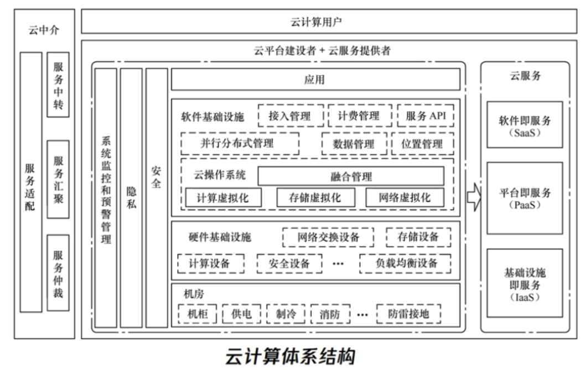

### 云服务

我们可能会见到 XaaS 这样的术语，它是 Everything as a service 的缩写。XaaS 是指完全由客户控制的，高度个性化，响应迅速，由数据驱动的服务和产品。

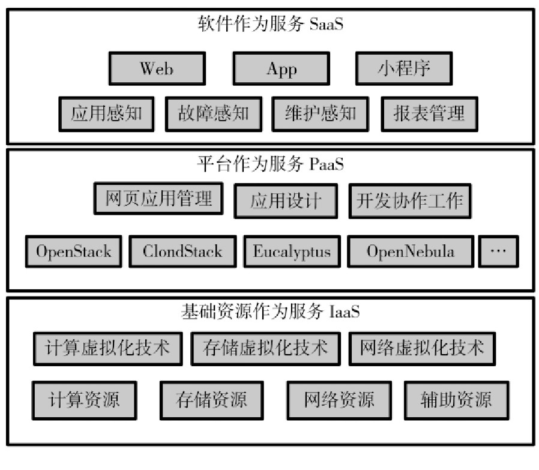

云服务曾分为三种：基础设施即服务 Infrastructure as a Service，平台即服务 Platform as a Service，软件即服务 Software as a Service。如今，云服务的粒度不断变小，现又新增了一种云服务——函数即服务 Function as a Service。

#### 基础设施即服务 IaaS

IaaS 与我们传统的计算机硬件的工作方式比较类似，但是 IaaS 的服务是虚拟化的，为我们提供了包括服务器、网络、操作系统及存储在内的云计算基础架构。类似于阿里云、腾讯云等云服务厂商，他们通常会有可视化仪表盘（控制台）或者相关 API 提供给用户，从而这些用户可以对其购买的服务进行管理和使用。

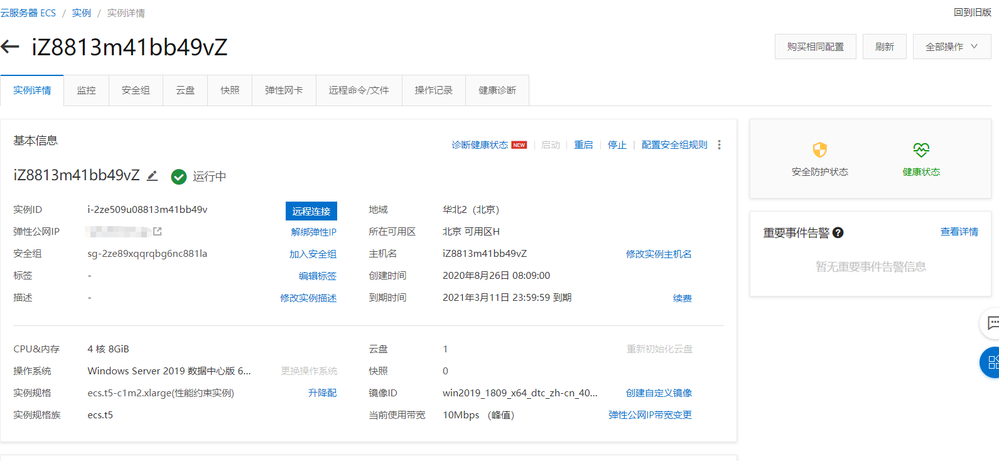

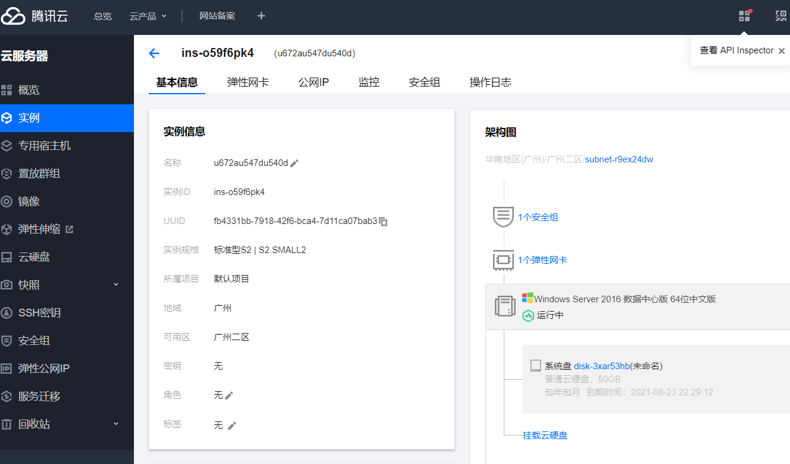

#### 平台即服务 PaaS

平台即服务 PaaS 服务于用户在平台上搭建的应用程序，为用户的应用程序提供 SDK 等相关云组件支持。PaaS 为开发人员提供了应用程序运行的环境及框架，开发者可以在这个平台框架上面创建自己的程序（类似于 Unity 以及 cocos 游戏引擎、微信小程序等）。以 cocos 游戏引擎为例，我们用 JavaScript 语言编写好游戏的相关代码后，游戏便可一次性适配电脑网页、安卓系统、iOS 系统、微信小程序等不同平台。

#### 软件即服务 SaaS

软件即服务 SaaS 即云应用程序服务，是云服务厂商提供最多的云服务类型。SaaS 利用互联网向用户提供由第三方管理的应用程序服务（例如文字处理服务、在线协作服务、云存储服务等）。大多数应用程序不需要下载安装，可以直接通过浏览器使用（如 Dropbox）。

#### IaaS、PaaS、SaaS 的区别

由于软件服务都由云服务商进行管理，SaaS 是其中最难以满足用户定制需求的，也是用户控制权最低的。不过这种服务一般价格相对较低。PaaS 中，用户可以管理自己应用程序与相关数据，其余的如操作系统、中间件等服务由云服务商管理，价格相对较高。IaaS 中，用户可以管理自己云服务上的全部的服务架构，这种方案灵活性最强，但价格最高。

其他区别如图

#### 函数即服务 FaaS

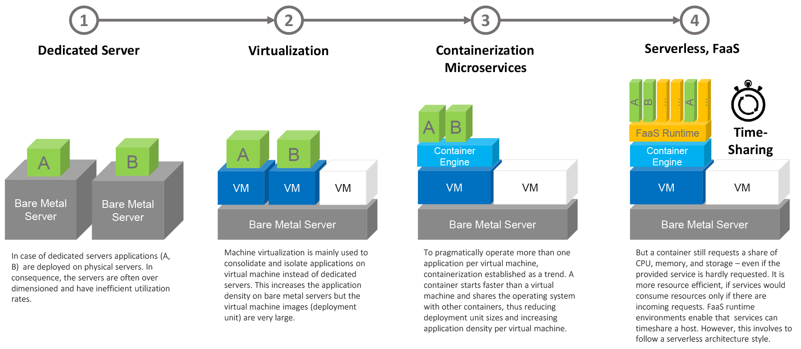

图中我们可以看到，云服务在过去十年间发展的趋势。最近，函数即服务 FaaS 也愈加热门，它将应用程序细分为多个功能，并通过明确的协议调用这些功能。类似于我们常用的 API，我们可以通过请求来验证人脸是否对比成功，也可以通过请求发送 SMS 短信等。

### 容器与虚拟化

如图，基础设施即服务（IaaS）为用户提供了一种可扩展且十分经济的方式，按用户需要配置及管理虚拟机（Virtual Machines, VM），同时云服务厂商仅按云服务资源实际使用的时间为租赁的云服务资源收费。

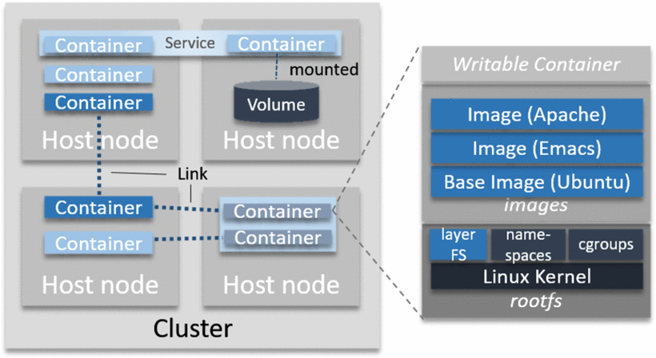

而容器化是一种以轻量级方式的虚拟化技术，与虚拟机不同，容器不是打包整个虚拟机，而是将运行目标软件所需的一切依赖项打包在一起。容器包含用户需要执行的应用程序，程序的依赖项，及操作系统部分模块。这使应用程序几乎可以在任何地方（用户的电脑、手机，其他云服务等）运行。故与虚拟机相比，容器更加轻便，更易于弹性伸缩，也基于此，越来越多的互联网平台更愿意用容器替代过去的虚拟机，以便更好地提供相应的互联网服务。

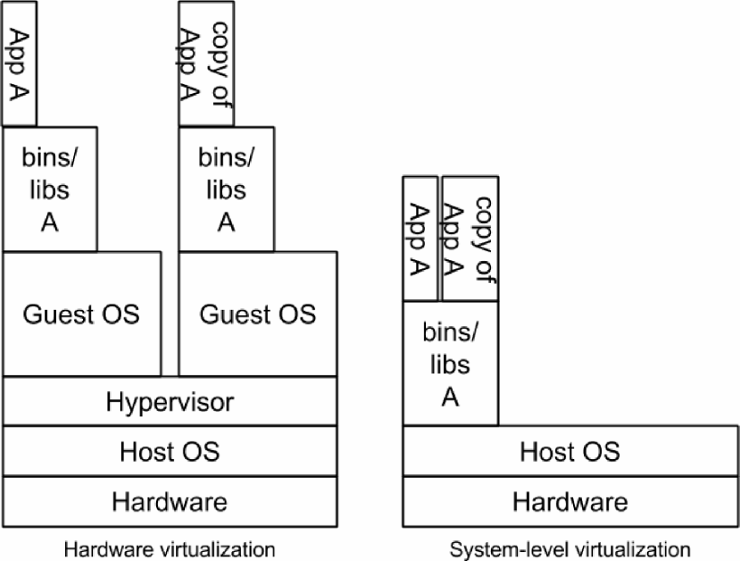

Docker 是我们目前比较常用的容器之一，它使用了系统级的虚拟化解决方案，在隔离的资源上处理数据，而不同的 Docker 容器之间又不互相干扰。它不仅可以用于控制容器里的进程，还解决了应用程序在不同环境使用的可移植性和应用一致性问题。在“现代云端平台的部署——以山东大学青岛校区计算机科学与技术学院代码评测平台 SDUOJ 为例”中，本文将详细说明 Docker 容器的相关功能。

### 消息队列

如今，许多应用程序都是在云服务环境中开发的。但是，为了使它们具有可伸缩性和弹性，我们需要采用新的设计模式，以便实现用户请求的负载平衡。

如图所示，消息队列主要由以下几个模块构成：

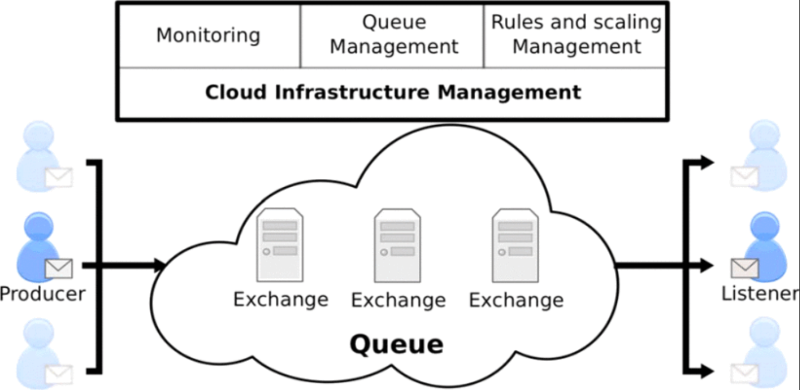

- 生产者与消费者。生产者多为连接用户的前端模块，在用户进行请求时，生产者将用户的请求消息添加至消息队列。消费者则与生产者相对，多为处理请求的云服务器、云容器等云计算资源。由于在不同时间段并发的请求数不同，而消息的处理频率是由处理请求的“消费者”决定，故需要消息队列缓存队列中存储的消息，以便“消费者”依次处理，以免请求丢失。
- 虚拟交换机。虚拟交换机可以对生产者所给予的消息进行分发。常见的 exchange 分发类型有 fanout、direct、topic、headers 四种，分别表示“广播”（把消息推送给所有绑定到这个交换机的消费者）、“路由”（通过分发向消费者推送特定类型的消息）、“主题订阅”（把消费者订阅的某几类特定主题的消息分发给对应消费者）、“标签订阅”（与 topic 类型相似）。
- 队列管理模块。队列管理模块由队列监控、队列管理、队列规则与规模管理等子模块构成，负责消息的最终管理、推送规则确定、监控队列健康程度、重启部分模块等工作。

目前的几种消息队列大致都采用了上述模型，并在并发式计算中发挥了较好的效果。

## 当代云计算的现状及应用

从计算机诞生至今，我们的计算机有了许多的变化，云计算也是如此。本节将介绍当代云计算在不同方面的发展情况。接下来将以山东大学的数据中心及与在线代码评测平台（SDUOJ）为例，结合相关技术介绍现代数据中心的设施布局及现代云端平台的服务框架，第三小节将讲述现代云服务商提供云服务的一些管理措施。

### 现代数据中心的部署——以山东大学青岛校区数据中心为例

目前山东大学青岛校区图书馆一层数据中心的一期工程已经建成。作为一个标准的数据中心，其配备了供配电系统、机房精密空调系统、制冷系统、动环监控系统、视频监控系统、门禁和气体消防灭火系统等一系列系统。

#### 供配电系统

数据中心的电源均为市电与 UPS 双路电源，可以保证在局部电路故障时，托管服务器仍能正常使用 24 小时以上。数据中心机柜左右两侧分别设置防爆插头，防止短路等意外对上级电路的影响。此外所有插座均有动环监控系统的实时监测，当电压等电气数据与设定值不符，或者累计用电明显异于过去同期，动环监控系统将发出告警，提示工作人员及时关注相关内容。

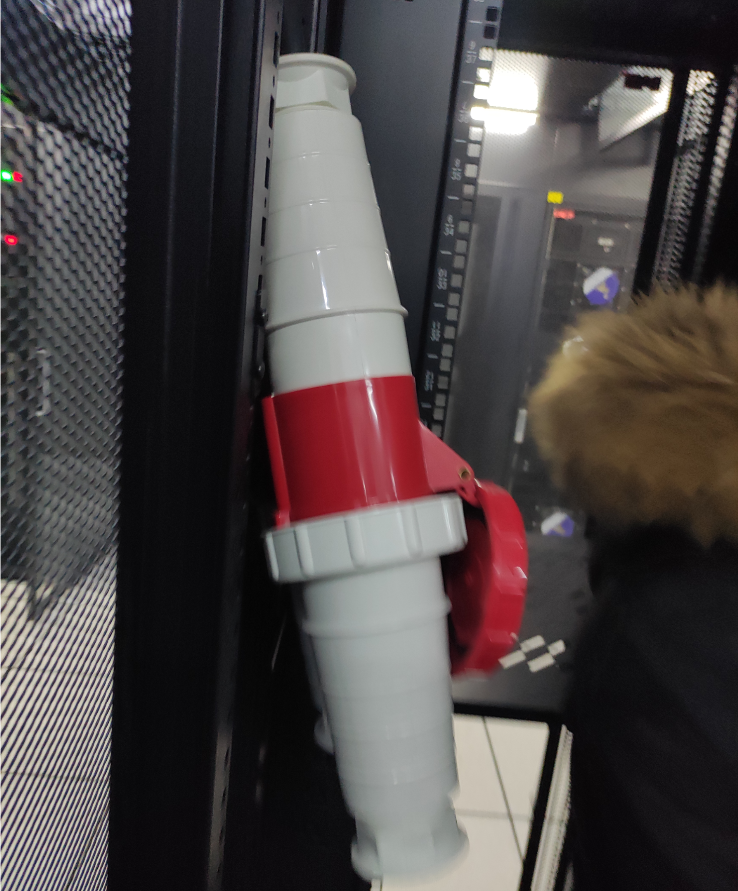

此外，云服务平台的数据中心除了需要预防上面所述的供电风险，还需要防御通过设备电源管理模块进行的攻击。Hyper Attack 通过数据中心管理服务中受损的电源管理模块，对数据中心进行内部电源攻击和虚拟机管理策略攻击，会使得数据中心的功耗增大 72%。所以，数据中心也应注意维护数据中心的电源管理等模块，以免供电不稳定带来服务中断、数据丢失等后果。

#### 机房精密空调系统与制冷系统

由于计算机芯片的工作效率在高温下会显著降低，数据中心需要良好的制冷系统与空调系统。常见的数据中心制冷空气循环模式有以下三种：

- 活动地板模式。像山东大学青岛校区数据中心一样，来自机房空调的冷空气从地板下方加压，吹向服务器机房。由于气温高的气体密度低，浮在上层，该系统在机房上方设置热风回收系统。这是数据中心常用的降温系统模式。
- 物理屏障隔离模式。2005 年起，一些工程师就开始在考虑这种将热空气冷空气分开的制冷模式。这种模式有许多优点，例如减少冷热对流造成的冷空气损失，使得单位气流带走更多热量，可以容纳更高密度的设备（即增大数据中心面积利用率）。
- 经济型冷却模式。当室外温度足够低时，室外的气体可以替代冷却水，带走服务器产生的热量。由于水的蒸发吸收热量，冷空气温度再次降低，可以使得单位冷空气带走更多热量。

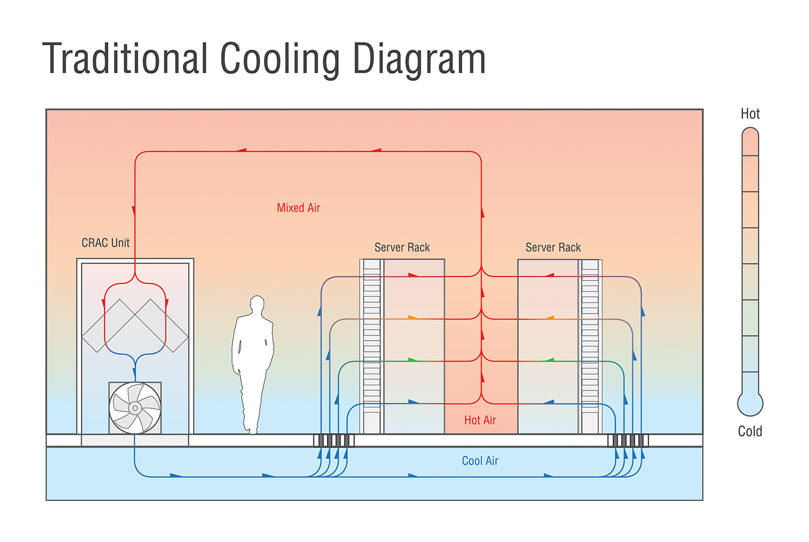

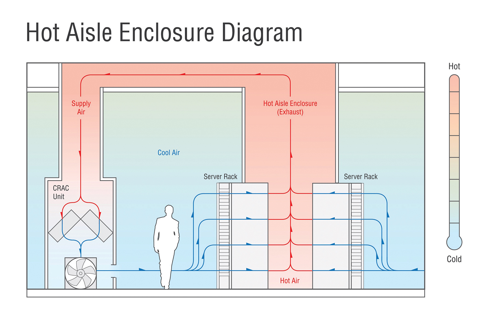

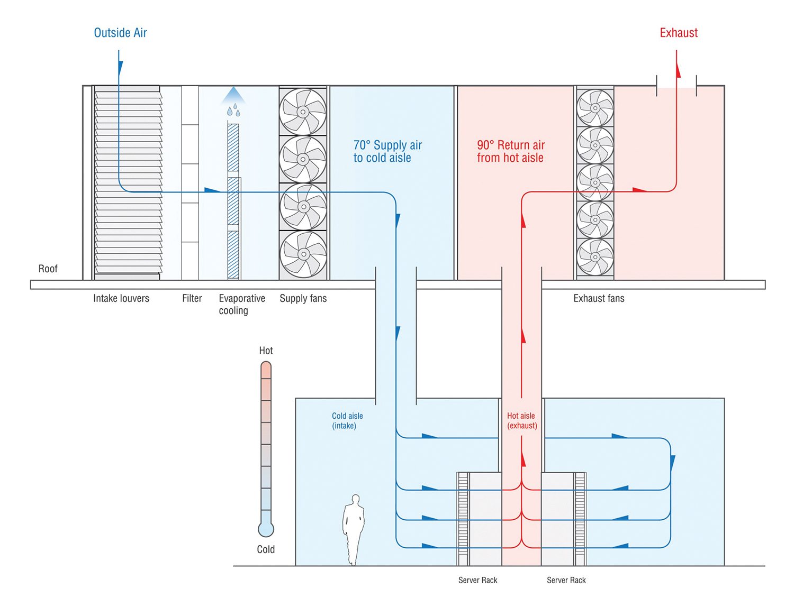

<b class="center-caption">常见的数据中心冷却方式</b>

在制冷模式的控制下，数据中心的$PUE$

$$PUE=\frac{\text{数据中心消耗的电量}}{\text{服务器消耗总电量}}$$ 

显著降低，现代数据中心$PUE$的理想目标值在 1.5 以下，根据 CIO 的标准，新数据中心的$PUE$目标应为 1.4 及以下。$PUE$为 2.0 及以上则表明数据中心需要进行审计（数据中心正在增加成本，却几乎无收益）。

#### 动环监控系统

动环监控系统又称动力环境监控系统，是一个集成了多种新兴技术（包括网络通信、数据库技术、传感器技术、物联网 IoT 技术等）的平台。它有助于监控机房的运行环境和设备的运行状态。运行环境状态如房间的温度和湿度状况、配电柜的电气状况、服务器的水浸状况等，而设备的状态包括 UPS、压力系统、空调、安全保护系统（应急照明及防火系统）等设备的运行状态。

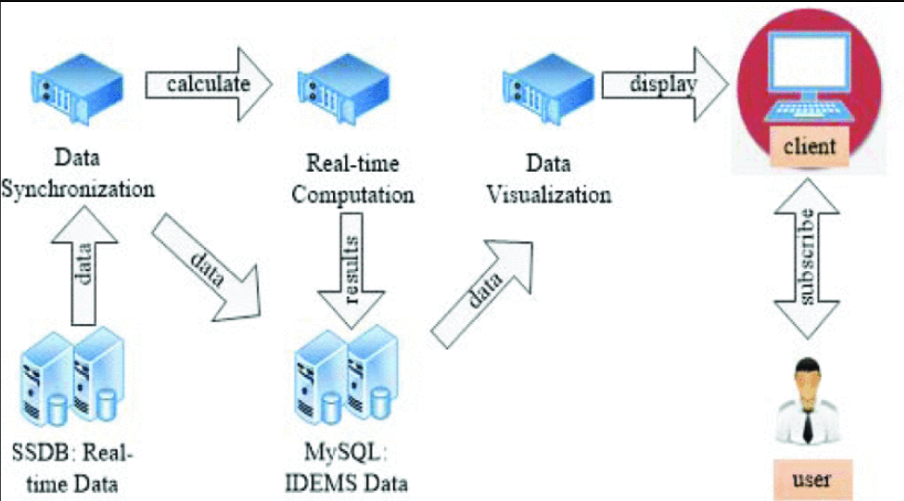

现代的动环监控系统主要有数据同步模块、数据分析模块、关联分析模块和可视化模块等模块:

- 数据同步模块。数据同步模块用于每个基础的设备数据的采集与同步。传感器按照设定的时间间隔记录相关数据，例如电池电压，冷却器温度等，然后将它们添加到特定的数据库中。这部分的难点主要有两部分，一是各传感器的时钟同步可能存在偏差，二是设备掉线重新上线时数据该如何补录。现代动环监控系统的做法是——根据通常在生产设备时分配的传感器 ID，整合来自同一设备的所有数据，并要求数据库插值存储，以确保动环监控系统始终能记录每个设备的所有测量点。
- 数据分析模块利用来自数据同步模块的数据，及其他静态配置参数评估各设备的运行状态，对当前数据中心运行状况进行评分，以及预测未来数据中心的运行状态。
- 关联分析模块。关联分析模块分析所有告警日志之间的关联，并为以后的决策提供科学依据。
- 可视化模块。可视化模块将数据可视化，并对于不同程度的告警信息向监控人员发出不同程度的告警。

#### 数据中心消防系统

由于数据中心的设备发热量大，数据中心设施的防火强度也高于一般建筑。总的来说，数据中心的防火措施分为被动式防火与主动式防火。被动式防火是提升建筑物的抗力与耐久程度，主动式防火则是防止火灾的爆发及烟雾的蔓延。在青岛校区数据中心，每排机柜上方都有消防管道，消防系统内有加压四氯化碳用于灭火。由于消防管道喷洒的四氯化碳会对人体的肺部造成严重的损伤，数据中心房间外有“放气勿入”的标识，当火灾触发报警时，该标识会自动点亮，提醒维护人员尽快撤离。图为数据中心消防系统结构图。

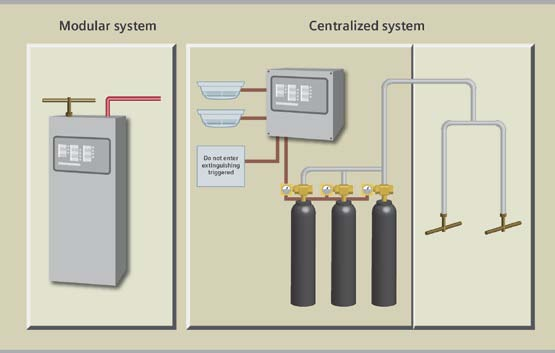

### 现代云端平台的部署——以山东大学青岛校区计算机科学与技术学院代码评测平台 SDUOJ 为例

OJ 是在线评测系统的简称，是计算机专业人员在线提交代码，即时获取代码正确性反馈的代码评测平台。出题者将题目描述及输入、输出数据上传至 OJ 上，答题者编写相关程序计算答案，将答案送入 OJ 的比较系统进行输出结果的正确性检查，最终 OJ 将检查结果反馈到平台上。

山东大学的代码评测平台 SDUOJ 是由计算机科学与技术学院学生搭建的代码评测平台，其采用的是现代 OJ 平台面向服务的分布式微服务架构。该平台使用了许多云计算的新技术：

#### 微服务架构

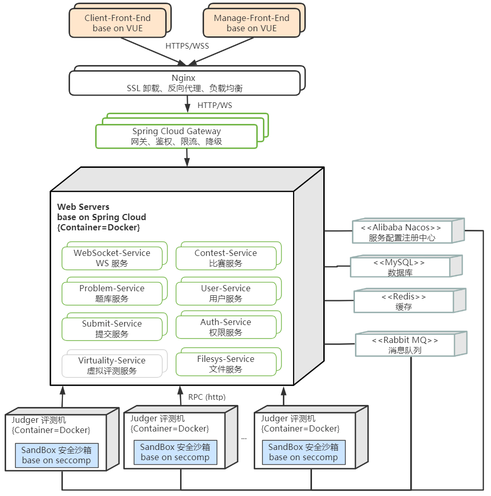

如图中间部分，各微服务之间相互独立，降低了整个系统的耦合程度。每个微服务均可单独进行扩容，相比整体扩容扩容速度较快。这个架构还使用了阿里巴巴的 Nacos 服务配置注册中心，中心将各微服务的全部实例进行注册，以便实现各服务中实例的负载均衡。此外该中心还可以快速配置各微服务，用户可以快速修改中心的部分开关，实现微服务各实例的同步修改。

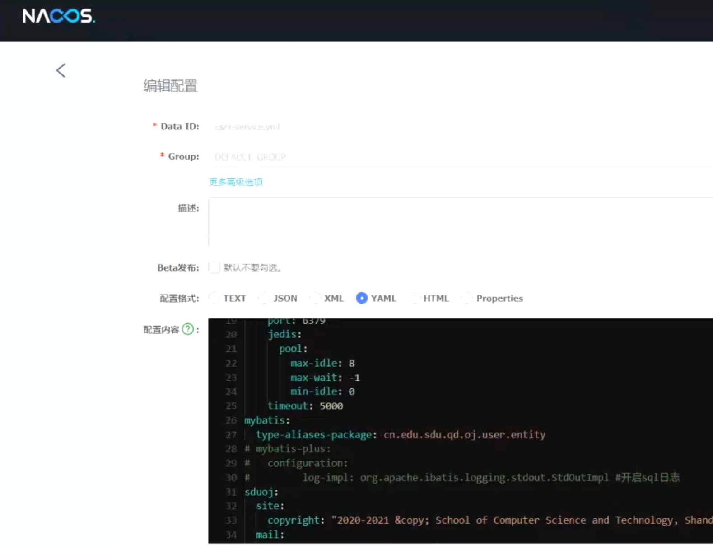

#### 使用消息队列

每当用户提交代码，服务器将用户按优先级放入对应的消息队列中；在评测机完成当前运行的任务后，会按照优先级顺序依次从各消息队列获取任务消息（如评测代号 RecordID），并通过提交微服务、文件微服务等获取评测所需的输入输出数据，以便进行代码的正确性评测。

#### 使用 Redis 缓存

对于用户反复请求的接口，若在相关接口上注解``@Cacheable("xxx")``，每当用户请求这些接口时，服务框架会先检查相应字段是否在 Redis 上存在缓存，若存在缓存则直接命中，而不去执行接口中的程序及请求数据库。当大量用户同时请求同一网页时，这种技术使得数据库的并发请求数大幅减少，从而减轻数据库的请求压力。

#### 在 Docker 容器中构建评测机

使用运行在 Docker 容器的评测机，既能保障并行评测的每个程序互不影响，也可以保证程序运行的环境是相同的（从而可以真实的体现程序的资源占用）。此外 Docker 还提供对于进程的限制性管理，OJ 可以通过这些功能来限制用户提交程序的文件读取权限、网络使用、RAM 占用等，以便保证评测的正确性以及保护评测机的安全。Docker 还具备前文容器部分中所述的快速动态伸缩的功能，当用户评测量骤增的时候，系统可以自动向云服务厂商申请容器的扩容，以便减少用户的等待时间；在用户评测量较少的时候，系统可以向云服务厂商申请销毁闲置的容器，以便节省不必要的开销。

### 现代的云服务管理措施

当前云计算服务提供商有许多提高云服务稳定性的管理措施，来保证用户数据和服务的可靠性。

#### 容灾备份

目前越来越多的互联网平台使用云计算服务，甚至很多公司把他们企业的数据也一并放在了云服务器上。不过，电缆中断及自然灾害等意外，将会带给数据中心灭顶之灾。为了保障用户的数据安全，云服务厂商通常都使用容灾备份的方式，在多地备份多份数据，以保证数据的可用性。

为了满足应用程序的连续性及数据的安全性，灾难恢复系统是一种“分布式计算，集中存储”的结构。根据不同的需求，灾难恢复分为三个层次，分别是数据级灾难恢复，系统级灾难恢复和应用程序级灾难恢复。数据级灾难恢复是最基本的，它可以确保应用程序数据的安全性；系统级灾难恢复对应用服务器的操作系统有着进一步的要求，以便尽可能缩短灾难恢复的时间。系统级灾难恢复要求实时，以至于用户无法感觉到发生的灾难。

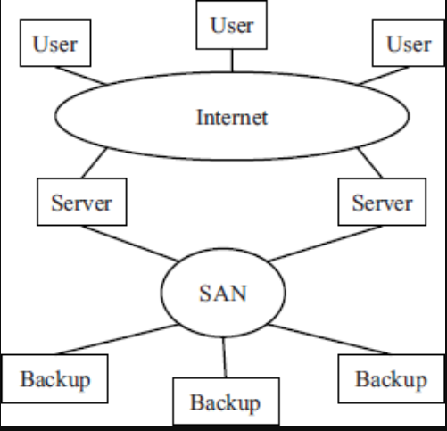

我们常见的容灾机制是异地多备份，如支付宝的数据和服务是三地五中心备份，但是多地备份会花费大量的资金，于是 Manish Pokharel、Seulki Lee、Jong Sou Park 等人设计了一个使用马尔科夫链的地理冗余方法。有别于传统的异地备份，这个方法不需要使用额外的物理架构，减少了人力物力成本。

此外，为了避免单服务器因负载过大产生的崩溃，Microsoft、清华科技及其他学者提出了他们对于云服务器的调度模型及灾备处理模型。

#### DDoS 攻击与防护

出于勒索或者同行竞争等目的，互联网平台使用的服务器容易遭受不法侵害，其中比较常见的攻击方式是 DDoS 攻击。DDoS 全称为 Distributed Denial of Service（分布式拒绝服务），攻击者常通过暴力攻击及漏洞攻击等方式使得目标机器无法被正常用户访问，以便达到自己的目的。

随着用户设备和网络服务的升级更新，DDoS 攻击的规模日益增大，2013 年的 Spamhaus 攻击时便已达到峰值 300Gbps 的流量，而 2016 年 New World Hacking 的攻击更是达到了峰值 602Gbps 的流量。为了有效地防御 DDoS 攻击，我们要对下面三个环节展开防御：

- 针对访问源的防御。这种方案通过清洗访问流量，拦截来自于部分 IP 段的 IP，但其他用户仍能够正常使用。
- 针对访问目标的防御。该方案通过 IP 的回溯机制，以及分组标记和过滤机制的做法，来筛选出有效的访问请求。
- 针对中间路由器的防御。我们通过防火墙或者代理的方式，将可能非正常访问的请求流向其他地方。类似于阿里云的 DDoS 高防服务，隐藏了服务器真实的 IP 地址，清洗无效的请求，将部分流量流向其他服务，以便耗尽攻击方资源（如图）。

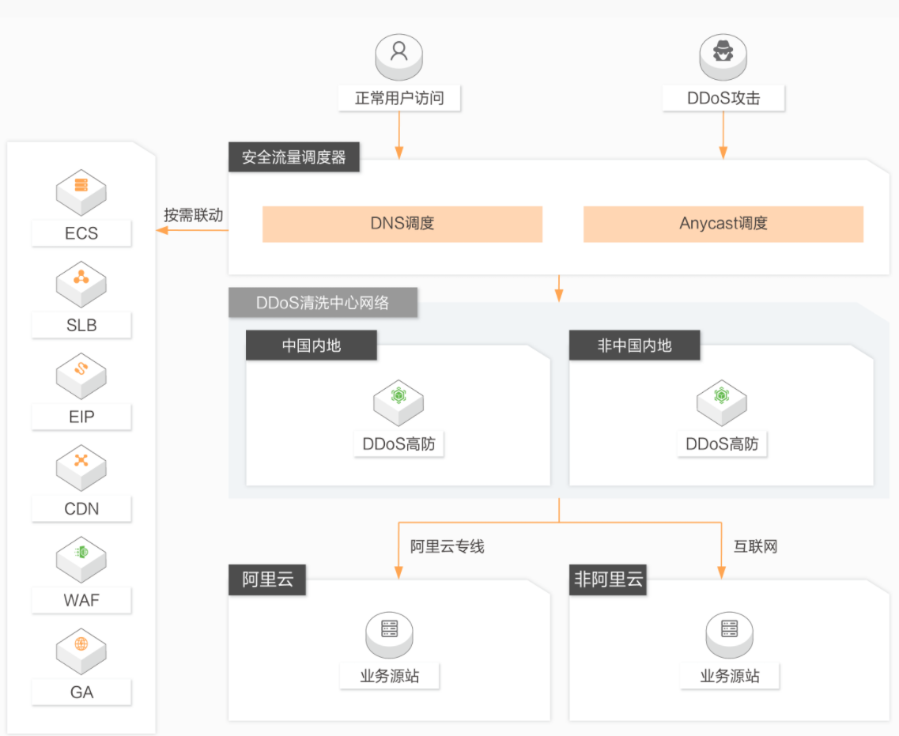

## 云计算遇到的挑战与解决方案

在云计算飞速发展的今天，云计算也遇到了许多的挑战。许多研究者给出了他们的解决方案，以促进云计算的不断发展。

### 云计算的挑战

当前云计算遇到了许多的挑战，目前最突出的有尾延迟、低利用、高能耗、高干扰等挑战。

#### 尾延迟

对于相同的网站，部分用户请求云服务的响应时间较长。这种挑战有两个可能的原因，一方面用户及云服务之间的网络环境不佳，另一方面用户的请求较为复杂，需要服务器请求多个数据库，在数据库应答中个别数据库应答不及时。在谷歌搜索中，对于绝大部分的搜索请求，谷歌都可以在 100 毫秒内给予回应；但是极小部分的请求，回应时长可能会超过 1500 毫秒。

#### 低利用

由于网络平台面向用户，网络平台的访问量依用户使用习惯而定，白天访问量高，夜间访问量低，每天呈现一定的周期性。而访问量低的时候，云服务使用率偏低，产生了一定的资源浪费。调查显示，主流云计算的 CPU 占用率低于 30%，盖特纳、麦肯锡调研的 CPU 使用率甚至不到 10%（，这极大地浪费了购置的计算资源。

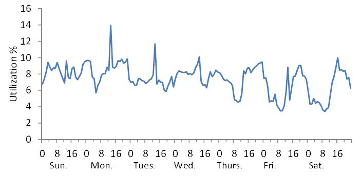

#### 高能耗

云计算产业是一项高耗电的产业。2020 年，我国数据中心共有 28.5 万个，年耗电 1200 亿千瓦时，占全社会用电 2%，已经超过三峡葛洲坝全年发电量的总和。研究显示，晶体管的密集排布会导致 CPU 的单位面积耗电量急剧上升，这使得摩尔定律接近极限。此外，服务器等云服务设备产热量高，制冷设备不得不长期运行，这使得$PUE$难以下降。

#### 高干扰

我们在使用操作系统级（容器）及以上层级虚拟化云服务的时候，不同容器（或函数等云服务）共同使用同一台物理机，可能会导致双方占用的资源相互干扰（例如一方突然进行 burst 操作占用总线，会减缓其他程序运行速率）。

### 解决方案

#### 尾部延迟最小化

Yong Cui 等人提出了尾部延迟最小化（TLM）问题，旨在优化尾部延迟问题，同时满足云 CDN 使用者的成本约束。

这个团队提出了 TailCutter，这是一种用于云 CDN 的新型工作负载调度框架。如图，TailCutter 包含三个关键组件：Request Scheduler（请求调度），Measurement Agent（度量代理）和 Local Proxy（本地代理）。当用户需要下载时，首先链接到 Local Proxy，Local Proxy 再向 Request Scheduler 查询用户请求应访问哪些 CDN 节点，以及这些 CDN 节点应分别下载哪部分的数据。在 Local Proxy 收到 CDN 和数据片段的一一映射表后，批量发送 HTTP-GET 请求，多线程下载数据。Measurement Agent 一般采用虚拟机存储各节点的带宽信息。当用户请求的时候，Measurement Agent 测量不同节点到用户不同代理的信息，以便用户选择适合的代理下载数据。

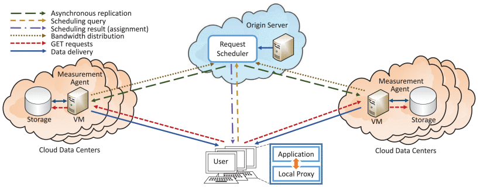

最终经过作者的验证，他们的 TailCutter 的调度算法实际运行时间为 0.12 秒，比一般的调度算法更为优秀，且可以使得尾延迟能降低 58.9%。

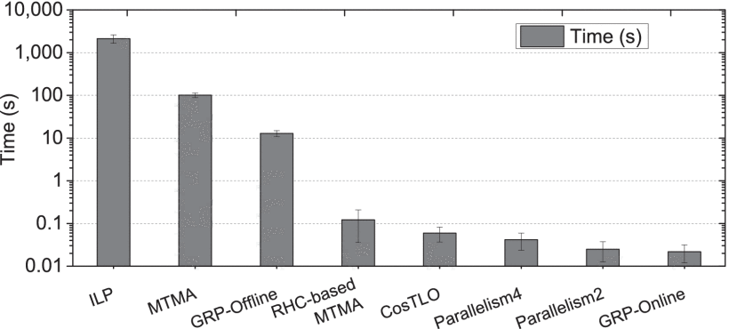

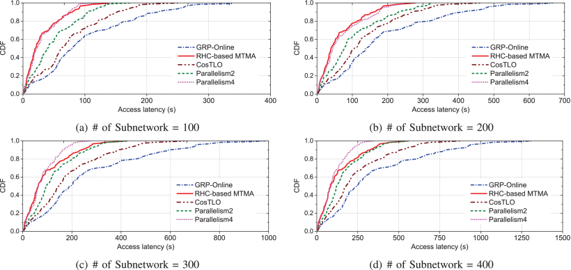

#### 标签化冯诺依曼体系结构

李克秋等教授提出了标签化冯诺依曼体系结构，这种结构对计算机有四个要求：

- 细粒度对象：系统内部的每一个请求（例如访存）均增加一个标签；
- 关联语义：标签值与上层使用其的虚拟化服务有关；
- 携带传播：各个计算机处理层级都全程携带给定的标签；
- 软件定义的标签控制逻辑：标签的分配是可以由软件定义和修改的。

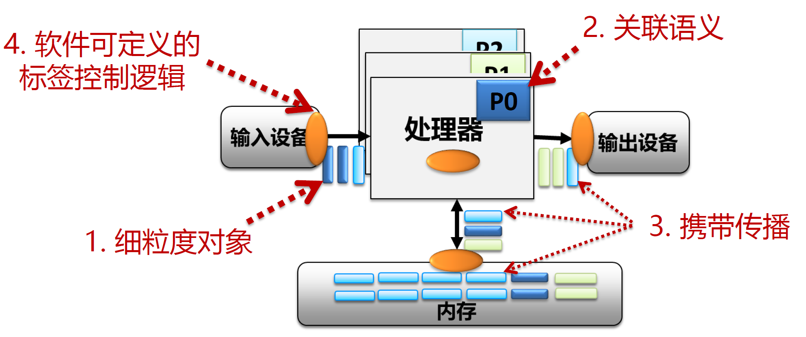

作者在控制逻辑的基础上加入了优先权控制，在 50%的带宽利用率情况下，内存控制器请求排队效率提高到原来的 5.6 倍 ，增快了服务器运行速度。

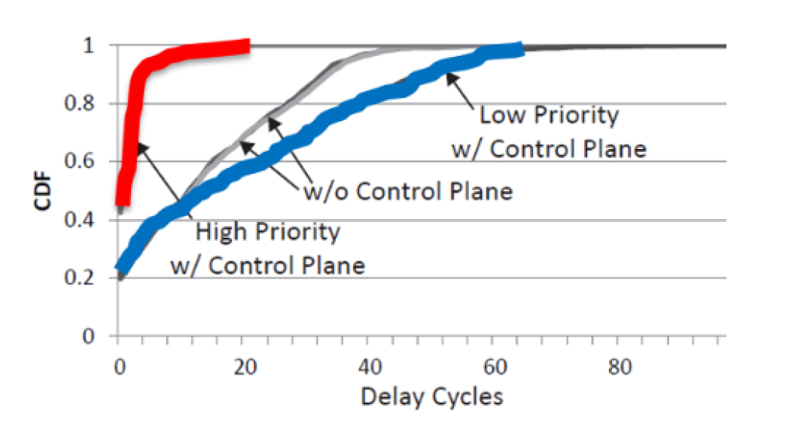

#### 使用云服务的视频实时流

我们经常发现，当我们看直播的时候，时间总是比发出者慢 10~20 秒，而转换码率则需要更长时间。为了使转换码率的直播推流更快的到达用户手中，作者提出了一种基于云的体系结构，该体系结构促进了实时视频流的转码，并提出一种调度方法使得延迟满足我们的预期。

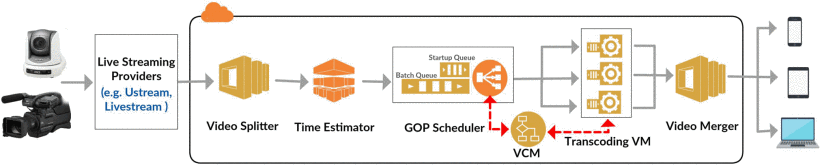

作者的体系结构分为六部分：视频分配器、时间估计器、任务调度程序、码率转换虚拟机、虚拟集群管理器，以及视频合并器。视频分配器负责将实时上传的数据流切分成视频段，并打上处理 deadline（如果处理时间已经晚于 deadline 则表示这个视频段无使用价值，应直接丢弃）；时间估计器根据局部性原理，用其相邻的一些视频段的转码时间估计当前视频段转码时间；任务调度程序负责将视频段推送给空闲的码率转换虚拟机进行分布式计算；虚拟机群管理器根据用户实际收到的转码后视频的质量，动态调整虚拟机的数量；视频合并器负责最终转码后视频段的合并与处理。

作者在调度时尝试了三种不同的调度方式：先到先服务 （FCFS），最短工作优先 （SJF）和最短截止日期优先（SDF），从图来看，最短工作优先的任务调度效率更好。

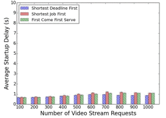

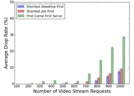

<b class="center-caption">作者的不同调度方式下码率转换性能比较</b>

#### 面向数据中心网络的链路故障实时检测即服务

上文指出尾延时的可能原因之一是用户的请求较为复杂，需要服务器请求多个数据库，在数据库应答中个别数据库应答不及时。为了解决这一问题，作者设计的服务架构，使得链路故障检测控制器与 SDN 控制器协同，以便实时检测云端的链路故障。

另一个作者，设计了检测设备间延时的 PingMesh 网络，检测数据中心网络的链路故障。

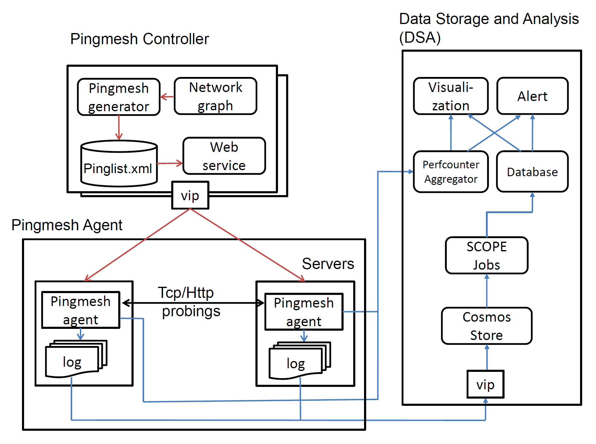

### 对云计算未来的展望

目前云计算已经深入到了互联网平台的方方面面，随着 IoT 器件与物联网的发展，云计算要处理的数据量将更加庞大，云计算产业发展仍有较大的前景。2020 年云栖大会上，阿里云发布工业大脑 3.0，通过可视化建模和云计算，虚拟仿真工业上的实验，这样的智慧工业使得物理产线与虚拟产线无缝衔接。此后，工业与云计算的联系也会更加密切，云计算带给各行业的福利也会越来越多。在人工智能不断发展的 21 世纪里，我们可以通过云计算得到更好的智能方案，从繁杂的数据当中获取更有用的信息为我们服务。

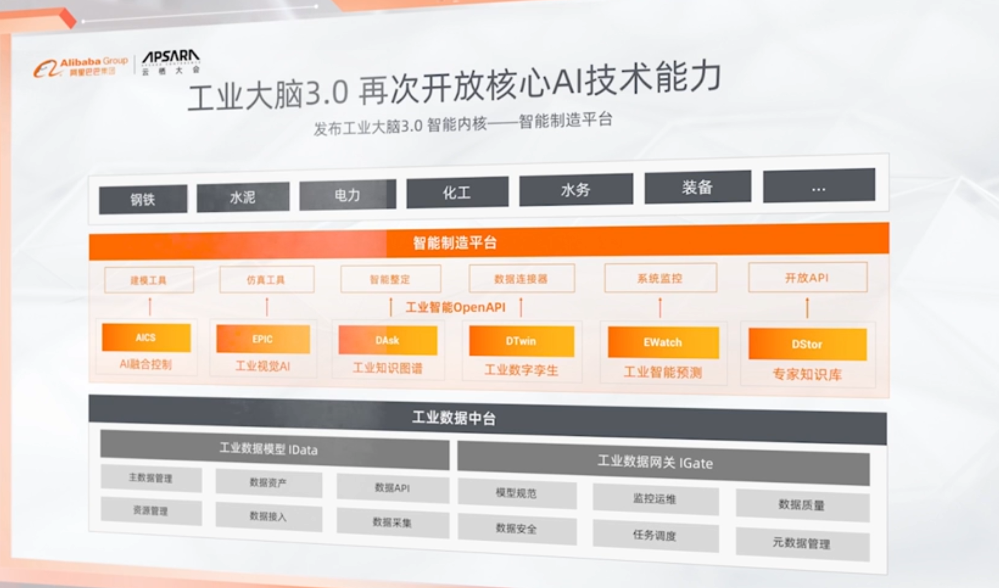

## 总结

本文通过对于云计算定义、发展历程的说明，阐述了云计算的基本内容与基本情况，并介绍了云计算当中比较热门的几个云计算服务及其原理。此外，本文通过山东大学青岛校区数据中心、山东大学计算机科学与技术学院代码评测平台来介绍了现代云计算的应用及技术点，也介绍了现代云服务管理当中必备的容灾系统及 DDoS 防御系统的原理。最后本文介绍了云计算目前遇到的挑战与困境，并针对这些困境介绍了部分学术前沿论文对于攻克挑战实现的架构及其效果。

## 致谢

感谢山东大学计算机科学与技术学院聂礼强教授为本文的编写提供指导，感谢天津大学李克秋老师带来的关于现代云计算的挑战及解决的介绍，感谢山东大学泰山学堂计算机取向的同学们为本文的编写提供帮助和支持。