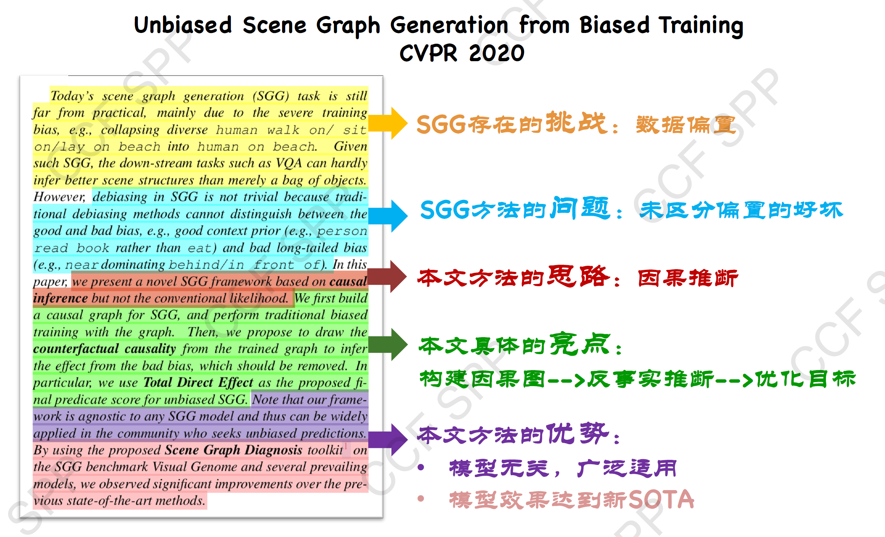
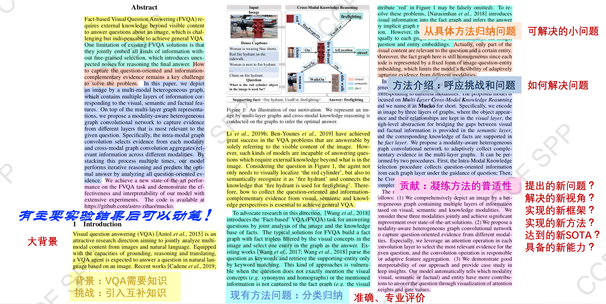
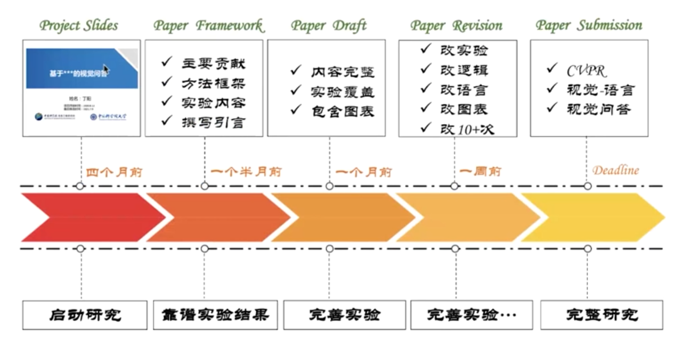

# 英文学术论文写作指南

本文章出自 CCF 学生领航计划 （CCF SPP），讲义和回放都挂在CCF的电子图书馆，这里放一个传送门，方便大家前去了解（第一周限免，第二周起需要CCF学生会员）。

> 第一期：学术研究与论文写作 [讲义地址](https://dl.ccf.org.cn/ppt/pptDetail.html?_ack=1&id=6015114958456832) [视频地址](https://dl.ccf.org.cn/video/videoDetail.html?_ack=1&id=6015101387786240)
>
> 第二期：英文学术论文写作规范与日常积累 [讲义地址](https://dl.ccf.org.cn/ppt/pptDetail.html?_ack=1&id=6025045838252032) [视频地址](https://dl.ccf.org.cn/video/videoDetail.html?_ack=1&id=6024786148001792)
>
> 讲者于静老师，b站帐号[于老师的日常](https://space.bilibili.com/301285406)

学术研究过程与论文写作过程是一致的，从确定研究领域，找到研究动机，提出问题，设计方法，实验验证最后总结展望，也是我们论文introduction related work到methodology和experiments最后conclusion的一个流程。

目前新手上路完成论文存在以下几个问题

- 学生什么都不懂，希望老师一步一步教；老师希望学生自己完成论文，自己只做点拨（甚至带带老师）
- 选择了很好的主题，得到了或许很好的结果，但是由于论文写作水平的原因，自己所写并不能写出整个论文的水平
- 论文无法准确表达研究的内容，把文章逻辑和自己的贡献讲清楚
- 论文在abstract把贡献写的很大，但根据后面实验的结果来看难以自圆其说，应该在写论文之前把所有的内容有个把握
- 持续拖延：写论文与科研应该是协同的，可能重要性占30-40%，不应该拖来拖去
- 不知道论文如何逐步完善

科研论文写作四步走

1. 价值观: 为何做科研？为何选这个问题？（第一期Why?）
2. 思路: 写哪些？什么逻辑？什么内容？（第一期What? ）
3. 写法: 怎么写？怎么改？怎么高效？（第二期How?）
4. 规范: 英文怎么写规范、简洁、清晰？（第二期How?）

## 研究动机——是否探究本质

| CCF-A                                    | CCF-C                          |
| ---------------------------------------- | ------------------------------ |
| 问题-方法-实验，相互呼应                 | 问题-方法-实验，各为其说       |
| 问题：有理有据，足够具体                 | 问题：大家都在研究，所以我研究 |
| 方法：针对问题设计，每一步设计目标明确   | 方法：step1->step2->step3      |
| 实验：针对方法逐一证明，针对动机逐一分析 | 实验：达到了SOTA，缺乏分析     |

> SOTA model: state-of-the-art model，并不是特指某个具体的模型，而是指在该项研究任务中，目前最好/最先进的模型。
>
> SOTA result: state-of-the-art result，指的是在该项研究任务中，目前最好的模型的结果/性能/表现。

## 各模块方法技巧

### 标题：核心问题与创新点的高度凝练

标题的基本要求：不超过15个单词、英文形式规范、语言精炼简洁、范围大小适当

一个好的标题：反应核心问题、突出技术创新、保护知识产权、易于记忆传播

一个不太好的标题：无法从标题中看不出工作或者贡献（创新点）、为了拼凑大写字母把单词中间的某个字母大写、或者直接凑了几个大写字母使得自己的论文难以记忆

> MuKEA: Multimodal Knowledge Extraction and Accumulation for Knowledge-based Visual Question Answering（CVPR 2022）
>
> 其中Multimodal Knowledge Extraction and Accumulation是贡献，Knowledge-based Visual Question Answering是领域，一目了然；为了方便记忆，把字母最好拼成方便读的单词，效果会更好

### 摘要——题目的扩展

现在这个问题存在的挑战->现有方法存在的问题->本文方法思路（1句）->本文的亮点->本文方法优势

### 引言

引言的内容与abstract格式大致相同，但是需要展开阐述。

引言要有理有据，足够具体：

- 背景阐述聚焦重点
- 问题提出明确具体
  - 背景时提的问题是这个task最核心的问题，要解决的任务的本质问题
  - 而Related work是具体某个方法提出来的问题，是某个方法的具体缺陷
- 聚焦研究动机，总结现状问题
  - 认真阅读，客观评价
- 基于研究动机，概述研究方法
  - 为什么方法可以解决问题，每一步具体是解决了问题的哪个部分，不需要详细介绍每个步骤
- 面向领域需求，拔高论文贡献
  - 准确评估自己的贡献，每个贡献要分开分点表述

介绍大背景->对现有方法问题进行归纳，进行客观的评价->从具体方法归纳技术问题->介绍自己方法，如何解决这些问题，每一步解决了问题的哪个环节->评估自己的贡献（提出新问题、解决的新视角、实现的新框架、新方法、达到了新SOTA、具备了新的能力）

### 相关工作

基本要求：

- 包括**理解本文**的所有主题，不要罗列看过的所有论文
- 包括**问题相关**的所有工作，Task或者我的方法的相关工作
  - 自己研究领域的相关工作+自己的方法在领域内外的应用+与自己方法起到相同的功能的方法的介绍
- 从不同维度划分主题
- 同一主题方法归类
- 总结问题
- 引出本研究的区别和贡献

### 方法

方法是最容易写的部分，可以先写。不过真正的科研论文，方法内是含有问题的研究思路的，而不是简简单单的第一步第二步第三步。

- 总原则：**换位思考，从读者角度出发**
  - 最费力的部分不一定是最重要的部分
- 问题建模：数学语言描述、确定研究目标
- 模型介绍：
  - 模型框架图，清晰定义模块，突出创新之处
  - 小标题确定，突出方法特色、用于、创新性，图文一致
  - 模型总体介绍，突出模块间关联
  - 分模块介绍，突出模块设计动机
  - 精简表达，善用公式，理论分析
- 根据重点，重新组织方法介绍思路
- 标题和图突出创新性和重点，相互呼应
- 每一步方法设计都有理可依，介绍这一步是解决了什么样的问题

绘制 Framework 图

- 把输入输出、模块（大块里的小块）表现好，一个例子贯穿始终
- 图上的模块名字与论文子标题要一致

每个过程首先介绍背后的动机以及目标，具体的过程可以分小标题或加粗来表现逻辑。

在讲方法之前，整体介绍模型设计思路，描写动机以及为什么不选择其他的方式的原因，以便给审稿人进行解释。

### 实验

- 一致：支撑理论/方法、动机（实验要印证工作的特性）
- 核心：提供重要实验结果
- 诚实：不只展示最佳个例（开源之后得到反差可能会影响自己学术生涯）
- 分析：给出结果的合理解释（为什么会这样，结果与设计的关联）
- 局限：给出方法的能力边界（写出自己方法的边界，不要凭空地去解释，可以学习ML的论文的设计）

提出一个具体的问题->针对问题设计方法，每一步目标明确->针对方法逐一证明，针对动机逐一分析，以不同的维度进行分析。

### 结论

尽量简洁、避免过度夸大地总结论文的**主要发现**以及**经过验证后的结论**，**介绍未来工作**等。

总结工作体现效果+说明局限指明方向

### 致谢

- 帮助这篇论文的人员、机构、项目资助
- 审稿人
- 提供建议的其他科研人员
- 非co-author

### 参考文献

- 不遗漏，查全
- 按照会议/期刊既定格式
- 常见错误：大小写、全称/缩写、漏写、名字错拼

## 做图规范

### 研究动机图绘制

- 记录方法需要的输入输出，**解决了什么问题**
- 使用专业语言和符号表达，**使用对比**表示和之前工作的不同
- 使用例子来帮助理解问题，避免歧义和偏见
- 减少大面积的文字，使得图片直观
- 合理表现本文的研究内容和挑战

### 模型图绘制

- 目标：确定思路是否清晰，逻辑能否形成闭环
- 有哪些步骤，分别解决什么问题，每个模块概念和边界在哪里
- 训练过程和测试过程是什么样的（**对边界进行确认**），**输入是什么，输出是什么**
- 排版问题、字体字号、图片大小等
- 精准语言描述每个**过程、变量、符号**
- **相同的概念颜色保持一致**（不然不知道是一个概念）
- **前后无歧义**（否则审稿人会觉得是不是有什么操作没展示出来）
- **展示自己的创新点，而不是展示自己费劲的部分，例如数据处理**

## 英语写作规范

### 精简的表达方式

- 用最简单的话表达最明白的意思，不需要非得凑成一句
- 一句话最好只表达一个意思
- 减少从中文翻译的英文
- 避免重复的表达

### 严谨的叙述逻辑

- 在术语使用之前进行定义，缩写为什么这么缩写
- 所有的符号在定义前后定义清楚，在全文表示相同的信息要用相同的符号
- 有清晰的段落结构，段落和章节之间有过度
- 图表文字清晰表达内容，与图注、表注、正文一致

### 专业的学术用语

- 表述自己的贡献的时候，不要过于绝对（the best）
- 不要过于口语化（As we know）
- 对于自己和他人的评价，不要太主观（good enough to）
- 学习《导师防秃指南》[The Most Common Habits from more than 200 English Papers written by Graduate Chinese Engineering Students](http://www.cse.cuhk.edu.hk/~cslui/english_writing1.pdf)
- 学术论文需要精准把握学术术语边界（共识），可以参考计算机CCF计算机术语工委的[CCFpedia](http://pedia.ccf.org.cn/)

### 规范的符号运用

- 阅读英文论文符号公式定义规范 [Comprehensive List of Mathematical Symbols](https://mathvault.ca/wp-content/uploads/Comprehensive-List-of-Mathematical-Symbols.pdf)
- 学习本领域的经典论文

### 客观的图表绘制

- 展示探究本质的全面结果：不要只展示自己方法的best case，客观展示自己的结果以便其他人复现参照
- 多视角量化分析结果提升原因
- 模型细节明确，提供代码

### 正确的文献引用

- 使用会议期刊标准模板
- 使用DBLP寻找文献信息
- 一键完善参考文献工具 [Rebiber: A tool for normalizing bibtex with official info](https://github.com/yuchenlin/rebiber)

### 坚守的学术道德

- 严守学术道德，切忌抄袭

## 日常积累

日常5L积累： Paper List, Idea List, Math List, English List, Code List

### Paper List

#### 找论文

- 从自己的方向找相关方向，收集相关的讲座、报告、workshop和综述
  - 会议里经常出现相关的综述
- 找一个经典的工作（引用量高的论文）
- 从一个工作向前向后找到整个发展脉络
  - 可以Follow研究团队，文章related work等

#### 读论文

读之前进行积极的提问，带着问题读论文——

- 文章是关于**什么领域**的？
- 解决**什么问题**？为什么要解决此问题？
- **创新点在哪里**？为何巧妙？
- 如何**验证**并得出结论的？
- 对“我”的研究**有何启发**？

用批判性思维读论文——

- 论文是否**正确、真正地**解决了问题？
- 论文所用的方法是否具有**局限性**？
- 论文的实验**能否证明观点** or 方法的有效性?
- 所读论文**没有解决的问题**，“我”能解决吗？
- 能采用比论文中**更简单的方法**解决问题吗？

循序渐进阅读——

- 第一遍：阅读标题、摘要和文中图表
- 第二遍：阅读引言、结论、关键信息，结合图表快速扫视其他内容
- 第三遍：整体阅读论文，可**跳过陌生复杂的技术、数学公式**
- 第四遍：增强**对数学、技术和未知术语**了解
- 为对领域深入研究，还可再多读几遍

系统记录——

- 记录文章的**主体内容**
- 记录**有启发**的地方
- 记录**有问题**的地方

对接下来工作的帮助——

- “我”**错过了**哪些相关论文？
- 这篇论文值得关注吗？对我的工作有何帮助?
- 这个领域的**领头人**有哪些？哪些团队值得关注？
- 如果我遇到作者，“我”会问什么问题？
- 下一步可以做什么？

文献整理——

- 按内容整理：将论文按照不同的主题进行分类
- 按时间整理：年份+ 来源+ 题目+ 内容简介
- 可以将领域内的经典模型方法记录在Excel 表格中，便于查找。

### Idea List

- 论文读好了，自然而然就有idea的list
- 根据所需目标、时间要求、资源实际情况统筹考虑idea顺序
- 及时复盘自己的计划

### Math List

- 积累基础的数学知识
- 对模型中重要的数学公式进行推导
- 积累领域常用的符号、公式，形成自己与专家的共同语言

### English List

- 积累专业知识相关的英语词汇
- 积累论文中的好句、好词（但是注意不要抄袭）

### Code List

- 注意代码的命名，注释规范
- 统一函数接口，形成自己的代码库，便于复用代码
- 整理深度学习框架的常用函数

## QA及小问题整理

- 论文写作及修改过程：

- 从论文到期刊：改进方法（更加通用、更加优化、可迁移性高、泛化性强）、扩展实验（增加数据集、对比方法、对比任务，更全面、更深入进行分析）、完善描述（背景、问题、模型、实验部分描述更加详细，related work随着方法设计内容更多增多）、增多contribution
- 本科生做科研的发展路径：找科研导师，给定点指导，复现论文，从调研小问题相关的工作，找到关联启发和改进。
- 在引言中挑战和问题哪个更重要：都是非常重要的
- Contribution在摘要和引言的区别：引言里详细写对领域的推进作用
- 写综述论文与这个有什么区别：刚入门时，更像调研报告，分类组织，找到相关问题，完成偏总结性文章；到博士中后期，对领域有非常多的理解，在小领域的范围内写现在有哪些方法以及他们的缺陷，存在哪些挑战，方法在哪些情况下是适用的。
- 在进入工业界如何提升学术敏感度：从技术与本质问题做关联，从细节中理解问题，把实际需求与本质问题关联在一起
- 找导师：为什么要来实验室，未来有什么计划？看看老师的方向，与老师沟通。
- 导师指导比较少，怎么发出第一篇：调研问题（选论文读论文讲论文）、把论文写好、给别人介绍工作以获得其他人的feedback
- Step by step不好的地方在哪里：让外行人无法看出自己的贡献
- 在开始研究问题前，如何积累对一个研究领域的认识：在网上找其他老师的tutorial，从他们所讲比较泛泛的内容进行了解，从打动自己的方向进行研究
- 如果研究内容比较工程，比较open，无法抽出研究问题：把实际问题用research的方法去解决
- 老师对于科研热爱的点在哪里：如果是充满好奇心去做新的东西，做好了可以有成就感
- 写论文先写中文框架还是全英文：先抛开语言，把逻辑表示清楚，再先按中文组织，但是写完之后一定要保证逻辑正确，再看看英文怎么组织
