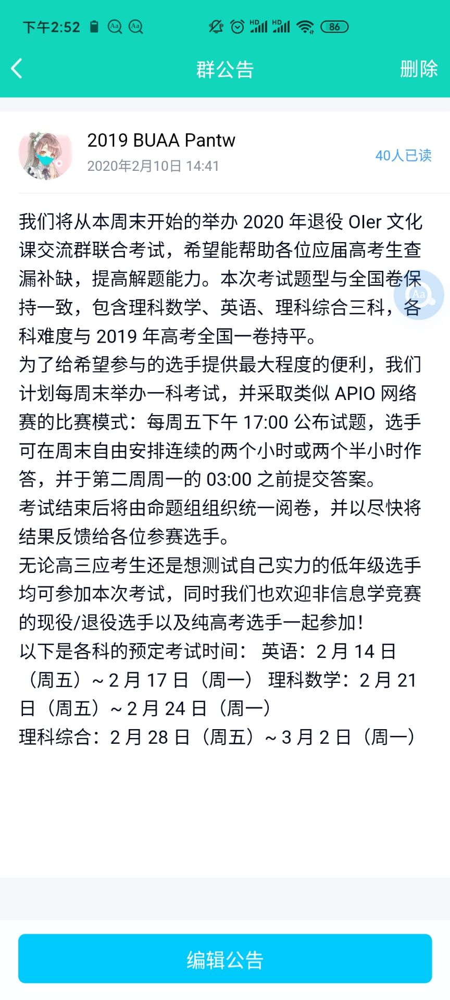
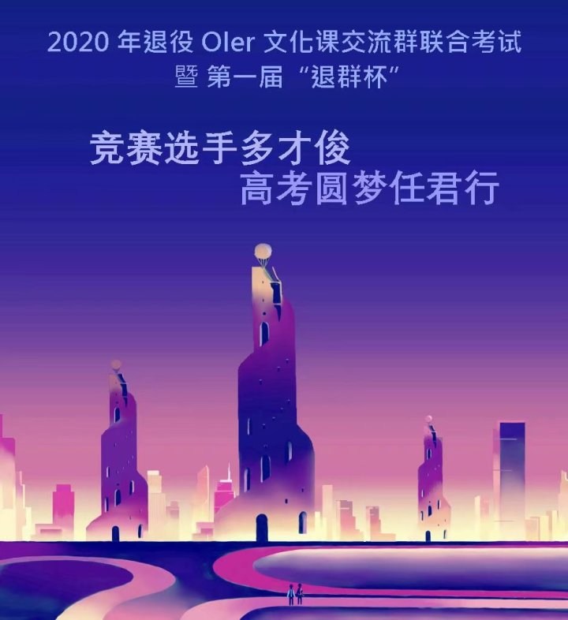
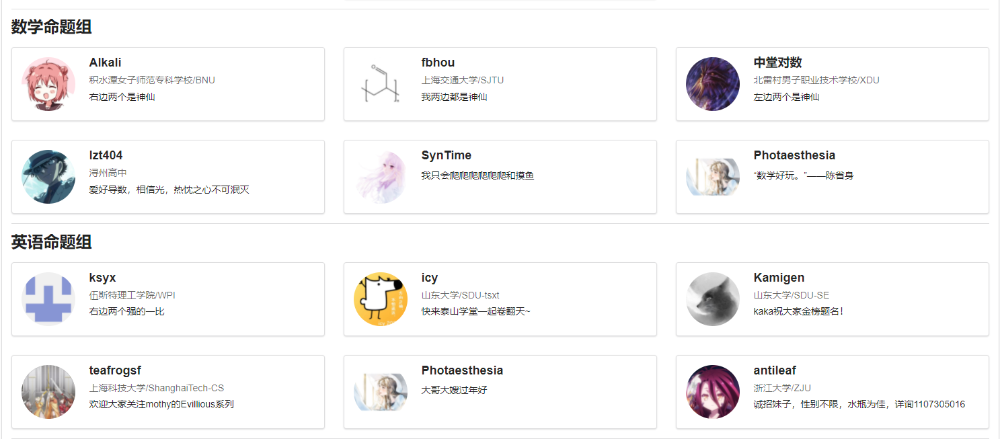

> 各位OI退役或还没退役的选手、各位对 XCPC 感兴趣或已经参与过的选手、各位仍在关注退群杯的同学~~以及各位乐子人~~：
>
> 首先祝大家新年快乐！我们非常荣幸地在此宣布，经过两个多月的前期筹备，第三届「退群杯」竞赛（XCPC 分场）即将与大家见面！
>
> 本届「退群杯」与前两届不同，其内容为**算法竞赛**，赛制则采取大家所熟悉~~如果不熟悉就现在熟悉~~的 XCPC 赛制，但改为**单人参赛**。正赛共⑨题，时长5小时，计划于2月12日下午进行。为方便各位选手熟悉赛制和办赛平台，正赛前一天即2月11日将有一场时长2小时的热身赛。赛后，我们将公开题解（PDF 格式）。如条件允许，我们也将准备一场直播讲解。
>
> 与第二届「退群杯」一样，本届「退群杯」也将有伴随题目的剧情。我们力图为大家带来更多参赛乐趣，得益于算法竞赛题目相对较高的自由度，解谜剧情将与题目充分结合。不过请各位选手放心，即使完全不看剧情也不会影响 AK 解题。
>
> 本次比赛我们为各位参赛选手准备了丰富的奖励，包括但不限于马克杯退群杯、桌垫、亚克力挂件，解谜成功更有机会领取神秘奖品！
>
> 退役 OIer 文化课交流群 第三届「退群杯」全体 STAFF
>
> 2022年2月1日

「退群杯」中的「退群」二字，可能与大家所熟悉的退群含义不同，指的是退役OIer文化课交流群（群号1107305016，其实由于OIer的不断迭代，其实也已经成为了一个社交文化圈，并衍生出了若干子群，退群杯群就是其中一个）。

由于自招取消，强基计划开始，高中生们也开始用脚投票，高中生OIer也越来越少。第三届「退群杯」即将开始，作为第一届第二届「退群杯」英语科出题人（前两届是文化课模拟考试，第三届开始为XCPC类考试），很高兴学弟们接过了「退群杯」的接力棒，让这种Oier学长学姐带学弟学妹的风气继续保持下去。

## 从无到有——第一届退群杯

由于主群退群「退役OIer文化课交流群」迭代了数次，导致一些历史不可考，此处仅能通过一部分聊天记录和个人回忆来还原历史。

其他组的成员看到都有在[知乎上](https://www.zhihu.com/question/371927453)发表自己角度的经历，我也分享一下我的经历。

当时看到了主群的群公告，征集一些群友一起给20级高中毕业生出套模拟题。当时正值疫情最严重的时候，各地也没法如期开学，大学生们也省去了各种各样非必要的活动，剩下的时间正好可以用来出题，于是我报名了英语组，也成为了第一届退群杯的英语组负责人。

当时一起去完成的有六七人，每人从选素材到高考题型的适配化，最后拼在一起，就形成了一套英语科试题。对于听力，当时没有条件去录音（我们的口音也不合适），然后我们最后的决定是找一些听力题拼在一起，我使用Au把各段听力进行了拼接，把ksyx用谷歌娘读的考试名称组装在一起，导出了听力音频。

当初一个组的SDUer还有Kamigen和Raffica，在后期高考结束志愿选择的时候，我们三位与其他群友劝退自己学校的行为相反，非常欢迎大家来SDU，于是我们三位的行为就非常亮眼，成为了退群杯群里的 SDU三人组。

在这次英语出题里，我记得我们还借此成立了一个英语口语交流组，以讨论班的形式举行。每位同学准备一次讨论的材料，然后其他人就会一起用英语讨论这些话题。当时因为有泰山学堂周小兰老师的英语口语课，我就拉了学堂的Arno同学，一起参与这个口语交流。当然在英语口语课结束之后那个群就长期咕咕咕了:sunglasses:。

记得在公告之前，大家讨论宣传文案，记得当时借鉴的文案来自UOJ——

> 10月26号，星期日晚上7:00~10:00开始公测！
>
> UOJ就要迈出第一步了！欢迎大家来捧场！
>
> 由于是公测，目的主要在于测BUG，所以是人民群众喜闻乐见的原题大战。
>
> 
>
> 不过不用担心！我觉得我选的题还是蛮好玩的！
>
> 为了应景，题目难度、部分分设置都和联赛差不多，对于想要为NOIP准备的同学而言是个不可错过的机会！
>
> 赛后我们会有详细的题解。
>
> 出题人有 ydc, vfleaking。
>
>
> 题目三小时三道题的OI赛制，
>
> 难度高仿noip，
>
> 大家也不用担心掉rating，
>
> 因为这一场是unrated哟，还怕什么！
>
> 这是神犇强者展现实力，虐爆全场的时候！
>
> 这是大众选手增强信心，迈向未来的时候！
>
> 还等什么？来战吧！
>
> 有什么问题请在下面留言。

最后一版文案如下（还好当时截了个图，不然真就没记录了2333）

以及当时做的宣传图，宣传图好像是Kamigen同学使用SCP同人图P出来的

Kamigen小姐姐真的很认真负责，最后英语科试题的讲评是她讲的，虽然由于设备原因，笔记本噪音比较大，但是小姐姐甜美的嗓音还是非常动人的（

我记得当时答题卡，一直不知道该怎么还原一个好看的答题卡，于是我盯上了当时高中用的“好分数”平台。果然高中班主任老师的密码还是6位数生日，然后我就用他的权限做了各科的答题卡，导出后删除（抹除痕迹）。

## 从小试牛刀到一次突破——第二届退群杯

第二年，出题组们又开始“搞事情”了。今年大家想做一个“剧情向”的比赛，大家按照不同的顺序完成题目，可以解锁不同的剧情。

在这一年，出题组里又来了许多新血液——例如第一届退群杯受众MikuNotFound同学，搭建了第二届退群杯的前端。

这一次，退群杯甚至有了[官网](https://tqb.kskun.com/)，用的是KS同学的域名和后端。大家可以通过在界面上注册登录进行做题，解锁剧情。

在[staff列表](https://tqb.kskun.com/doc/staff)的同学们越来越多啦，大家不光可以展示自己的id和头像，还可以放上一句话简介。数学组比较会玩，而英语组就没能提前商量好:cold_sweat:。

附第二届退群杯相关知乎文档

[2021年退役OIer文化课交流群联合竞赛暨第二届“退群杯”预告](https://zhuanlan.zhihu.com/p/350271701)

[第二届退群杯的一些近况](https://zhuanlan.zhihu.com/p/343210737)

[第二届“退群杯”正式上线公告](https://zhuanlan.zhihu.com/p/353375513)

[第二届“退群杯”剧情与数值系统前瞻](https://zhuanlan.zhihu.com/p/351085436)

